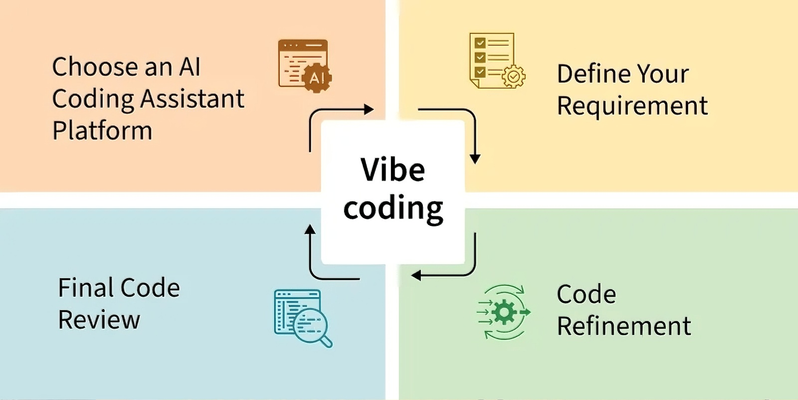

## 工作流

应用场景：
- 构建原型：规划项目整体方向、技术选型与系统架构。
- 规范风格：统一代码规范、技术文档的风格和约定。
- 处理细节：一些具体实现的细节，比如解决bug。

### 1. 检索增强(RAG)

先让AI充分学习。

### 2. 结构化提问

- 赋予角色[^1]
- 确定约束
- 分点提出具体任务

### 3. 优化

- 重构代码，生成注释
- 生成技术文档

## 边界

- 不要让AI生成未充分学习的内容。
- 不要让AI作全链路的工作。
- 不要让AI代替你思考。

[^1]: DeepSeek AI辅助生成
