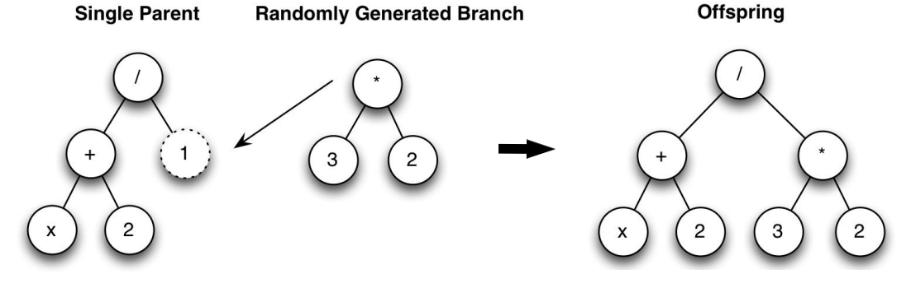
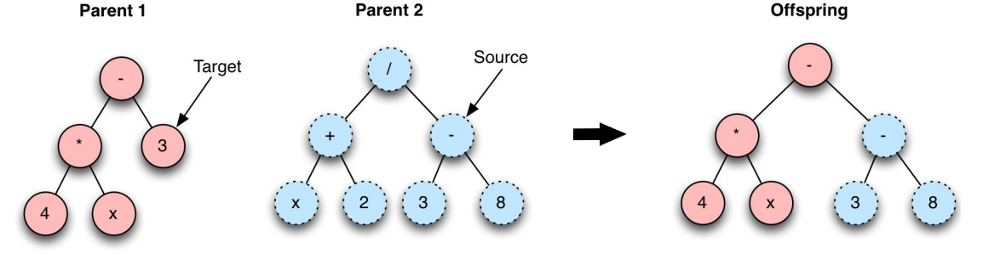
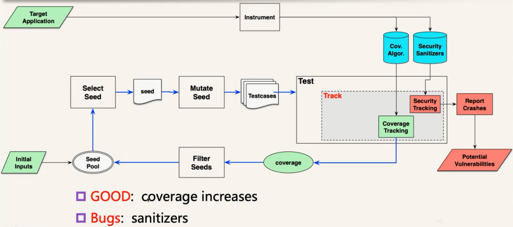
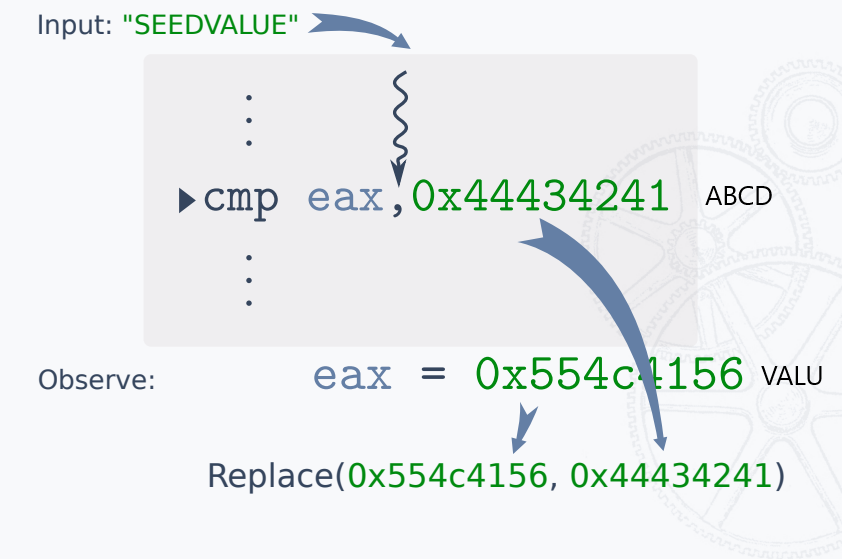
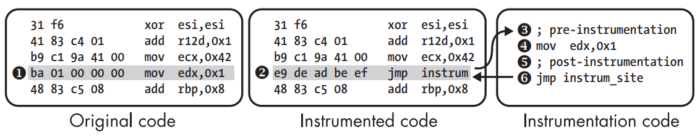
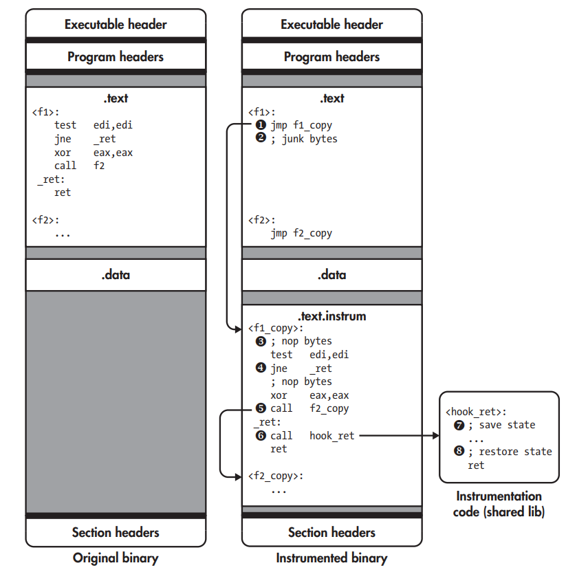
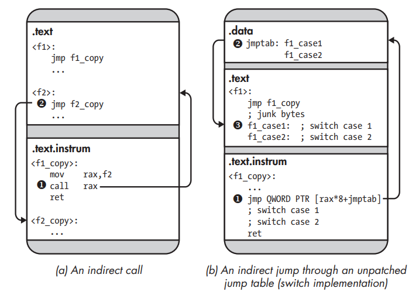
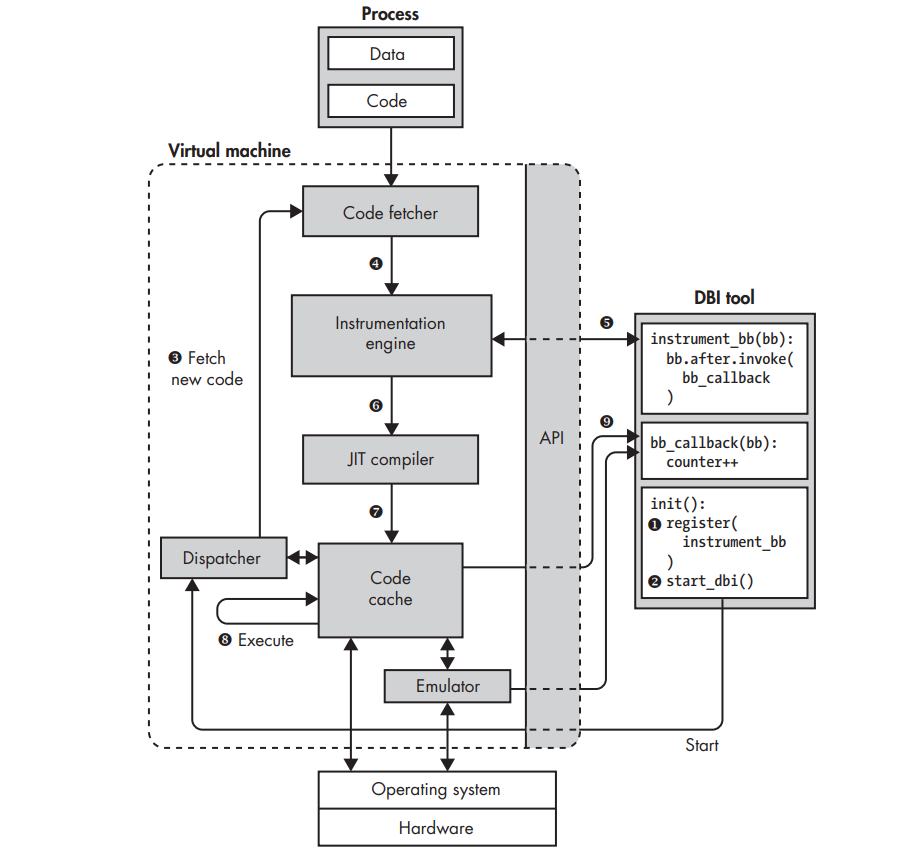
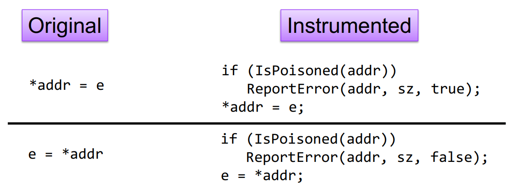
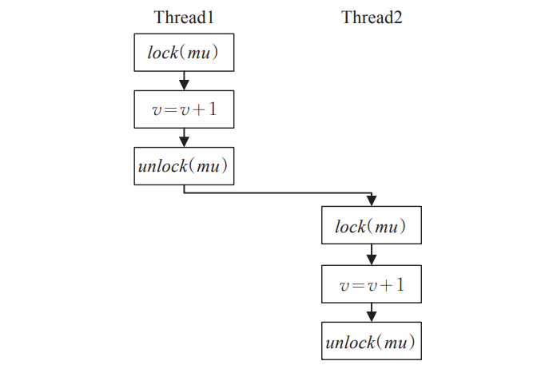

## 概述

### 一、遗传编程

遗传编程(Genetic Programming)[^1]是进化算法中的一种。GP的工作过程：
1. 初始化
2. 评估适应度
3. 根据适应度进行概率性选择
4. 通过遗传算子生成下一代
5. 判断是否符合终止标准，不符合则继续迭代

#### 1.选择

基于适应度(fitness)选择个体的过程，被选择的个体在之后会作为父系通过遗传算子繁育下一代程序个体。例如，AFL中将新状态作为适应度(当有新的 tuple (基本块->基本块)出现或已有 tuple 中出现新的命中组则视为产生新状态)。每次执行程序后，对比位图有无产生新状态来决定是否保存测试用例。

#### 2.遗传算子

经过一轮选择得到适应性较好的父体后，遗传算子对父体(parent)进行遗传操作，生成子代(child)。遗传算子主要包括以下两种：

**2.1 变异（Mutation）**

一个父体的随机部分变异。常用的一种subtree mutation：在一个父体中随机选择一个突变点(mutation point)，随机生成一个子树，将父体中以突变点为根节点的子树替换为这个随机生成的子树。



**2.2 交叉（Crossover）**

两个父体基因的混合/交换。常用的一种子树(subtree) crossover过程：在每一个父体中随机选择一个杂交点(crossover point)，复制第二个父体中以杂交点为根节点的子树，将一父体杂交点下的子树替换为二父体下的子树，生成子体。



子树crossover由两个父体随机生成了一个子体。其他多种交叉/杂交方法中，也存在由两个父体生成两个子体的种类，如one-point crossover

### 二、通用框架

1990年左右提出的Fuzzing测试流程：受遗传编程（GP）启发，生成器/变异器通过某种方案生成输入，监控程序检测目标程序是否产生bug，以此为反馈作用于变异器。



常见的配置：
- 适应度和进化指标均为边覆盖率(Edge Coverage)，遗传算子采用变异和交叉。
- 如果一个输入提高了边覆盖率，称为good种子。
- 采用插桩作边覆盖率的统计。
- Sanitizer作程序的安全跟踪。

### 三、分类

模糊测试按照应用场景分类：
1. 黑盒模糊测试：最简单的方法，只需要不断构造输入判断是否产生bug。
2. 灰盒模糊测试：最常用的方法，通过对目标程序进行静态插桩、动态插桩，在模糊测试过程中根据覆盖率的反馈来调整变异。
3. 白盒模糊测试：通常结合静态代码分析和动态执行路径分析，可以针对特定的代码路径、函数调用和数据处理逻辑设计测试用例，以探索更深层次的漏洞和错误。

## 测试输入

### 一、通用变异

在覆盖率统计过后，interesting的testcase会被保留，等待下一轮的变异。通用的变异分为三类：
1. 确定性变异deterministic
2. 破坏性变异havoc
3. 拼接splicing

#### 1.确定性变异deterministic

包括在测试用例的内容上进行单个的确定性变异。

**1.1 位翻转**

STAGE_FLIP1 每次翻转一位(1 bit)，按一位步长从头开始。
STAGE_FLIP2 每次翻转相邻两位(2 bit)，按一位步长从头开始。
STAGE_FLIP4 每次翻转相邻四位(4 bit)，按一位步长从头开始。
STAGE_FLIP8 每次翻转相邻八位(8 bit)，按八位步长从头开始，也就是说，每次对一个byte做翻转变化。
STAGE_FLIP16每次翻转相邻十六位(16 bit)，按八位步长从头开始，每次对一个word做翻转变化。
STAGE_FLIP32每次翻转相邻三十二位(32 bit)，按八位步长从头开始，每次对一个dword做翻转变化。

**1.2 加减法**

arith 8/8，每次8bit进行加减运算，8bit步长从头开始，即对每个byte进行整数加减变异；
arith 16/8，每次16bit进行加减运算，8bit步长从头开始，即对每个word进行整数加减变异；
arith 32/8，每次32bit进行加减运算，8bit步长从头开始，即对每个dword进行整数加减变异；

**1.3 兴奋值进行整数代换**

interest 8/8，每次8bit进行加减运算，8bit步长从头开始，即对每个byte进行替换；
interest 16/8，每次16bit进行加减运算，8bit步长从头开始，即对每个word进行替换；
interest 32/8，每次32bit进行加减运算，8bit步长从头开始，即对每个dword进行替换；
以interest32/8为例：
``` c
#define INTERESTING_32 \
  -2147483648LL, /* Overflow signed 32-bit when decremented */ \
  -100663046,    /* Large negative number (endian-agnostic) */ \
  -32769,        /* Overflow signed 16-bit                  */ \
   32768,        /* Overflow signed 16-bit                  */ \
   65535,        /* Overflow unsig 16-bit when incremented  */ \
   65536,        /* Overflow unsig 16 bit                   */ \
   100663045,    /* Large positive number (endian-agnostic) */ \
   2147483647    /* Overflow signed 32-bit when incremented */
```
**1.4 字典**

会把用户提供的token替换、插入到原文件中。

#### 2.破坏性变异havoc

变异是随机叠加的，还包括改变测试用例的大小（例如添加或删除部分输入）。

#### 3.拼接splicing

将两个差异明显的测试用例，各切一半，合并为一个，并执行破坏性变异。

### 二、REDQUEEN

REDQUEEN探索了绕过困难比较和(嵌套)校验和检查的方案，但不使用诸如污点跟踪或符号执行之类的昂贵技术。该模糊测试方案专注于Input-to-State（I2S）的比较[^2]，这是一种与至少一个操作数中的输入直接相关的比较类型。作者表明，许多障碍都是这种类型的，并开发了一种定位和绕过它们的技术。

I2S关联的例子如下图所示。对cmp指令进行hook，运行指令时可以观察到eax的值为VALU，0x44434241则为ABCD(均为小端序)。



input中同样有VALU出现，由此推断：如果将输入中的VALU替换为ABCD，就有较大可能绕过这个障碍。


## 反馈策略

### 一、插桩

插桩技术[^3]是在程序中插入探针和代码段，来收集运行时的信息，常用于安全测试和动态代理。例如Fuzzing、DTA、ASAN都使用插桩来实现相应的功能。在Fuzzing中，插桩的目的是统计边覆盖率信息，反馈指导后续的测试过程根据插桩的方式和目标的不同，插桩技术可以分为3种：
1. 源码插桩，在已知源码的情况下进行插桩。这种情况下不必考虑重定位的问题，根据编译器技术的不同，有汇编级别插桩(如afl-as)和编译器级别插桩(如LLVM pass)两种方式。
2. 静态二进制插桩，需要考虑重定位的问题，使用二进制重写技术来永久修改磁盘上的二进制文件。
3. 动态二进制插桩，DBI不修改磁盘上的二进制文件，而是在二进制文件执行时监视它们的进程，并在指令流中动态插入新指令。这种方法的优点是避免了代码重定位问题，因为：插入代码只注入到指令流中，而不注入到内存中二进制的代码段中，因此它不会破坏引用。

#### 1.源码插桩

**1.1 汇编级别**

使用的是trampoline（跳板）方案，在重定位生成PIE文件之前，在汇编文件的.text节中的每个基本块中插桩。因此，需要检测函数名或条件标签：
1. main函数，入口点。
2. .L<whatever>，GCC跳转标签。
3. .LBB0_0，只在clang模式下的跳转标签。
4. jnz foo，以jnz为例的条件分支。

插入的代码trampoline相当于一个inline函数，该函数的工作：
1. 调用函数生成随机数，作为基本块的标识符和参数
2. 传递给记录边覆盖率的函数

**1.2 编译器级别(LLVM模式)**

LLVM是编译器后端，常搭配clang等前端使用，LLVM Pass 是一些中间过程处理 IR 的可以用户自定义的内容，可以用来遍历、修改 IR 以达到插桩、优化、静态分析等目的。

llvm_mode可以实现编译器级别的插桩，可以替代汇编级别使用的比较粗暴的汇编级别的重写方法，且具备如下几个优势：
1. 编译器可以进行很多优化以提升效率；
2. 可以实现CPU无关，可以在非 x86 架构上进行fuzz；
3. 可以更好地处理多线程目标。

#### 2.静态二进制插桩

SBI需要对二进制程序反汇编，然后按需添加插桩代码，更新二进制程序存入磁盘。首先来看最朴素的插桩方法，如下图所示。假设要对mov edx，0x1指令插桩，可以使用jmp指令将其覆盖，跳转到插桩代码。在插桩代码中：对寄存器状态进行保存，执行mov edx，0x1和标记代码(用来统计覆盖率等)，恢复寄存器状态，返回到正常指令。



这种方法有两个问题：首先jmp instrum指令是5个字节，如果插桩目标指令小于5字节，会出现覆盖下一条指令的问题；第二，插桩目标指令与标记代码一起执行，会造成寄存器状态的混乱。

因此，SBI需要处理重定位问题，有两种常用的方法：int3和跳板trampoline。
1. int3方案，使用x86的int 3指令，调试器用其实现软件断点，SBI库同样可以捕捉SIGTRAP信号，通过ptrace找到中断的地址，从而获取插桩点地址。相比于使用jmp覆盖原来的指令，使用int 3指令来覆盖只有1个字节0xcc，后面可以填充nop平衡相对地址。缺点是：int 3软件中断时间开销大；如果程序本身有很多int 3指令，会和插桩的int 3指令相混淆。
2. 跳板(trampoline)方案，是简单方法的改进，以函数为单位进行插桩。创建所有函数的副本，放在新的代码段.text.instrum中；用jmp指令覆盖原始函数的第一条指令，使其跳转到副本函数。后面使用垃圾字节平衡相对地址。同时，在副本函数中，可以在每条可能的插桩目标指令前插入若干nop指令，方便使用call覆盖跳转到标记代码；为了相对寻址的正确性，重写所有寻址指令。例如，需要对ret指令进行标记，则在ret前覆写指令call hook_ret，hook_ret是标记函数，可以由SBI的动态库提供。在hook_ret中保存寄存器状态，运行相关指令，恢复寄存器状态。



上面的方案适合于直接调用、直接跳转和间接调用。对于间接跳转，以switch的汇编实现为例，需要修改跳转表中case地址，指向副本中的case。



缺点是：复制了所有函数，使得二进制程序占用空间增大；间接跳转需要额外的工作；对于内联数据，可能造成对数据的覆盖。最后，SBI的正确性都建立在反汇编的正确性上，如果反汇编有问题，一切修改都会破坏原来的二进制程序。

#### 2.动态二进制插桩

DBI通过监视和控制所有执行的指令来动态插桩进程，不会出现SBI的各种问题，在现代平台上也不比SBI慢太多。
一个DBI系统有很多组成部分，如下图所示。在操作系统上，虚拟机用来实现在指令流中动态插入新指令，而不会破坏主机内存中的进程。DBI工具用来启动DBI系统、与插桩引擎交互。



1. DBI工具向DBI系统注册函数instrument_bb，DBI引擎依此对基本块插桩。
2. 初始化函数启动DBI系统。
3. 最初代码缓存是空的，DBI系统从进程中提取代码。
4. DBI系统对其进行插桩。
5. 插桩是根据instrument_bb函数。
6. 插桩后，DBI系统调用JIT编译器编译代码，将机器码编译成机器码，并重新优化插桩。
7. 编译后的代码存储在代码缓存中。
8. 大多数指令在代码缓存中直接执行，特殊处理的系统调用等指令使用仿真器进行仿真。
9. 被插桩的代码基本块在执行时，会调用插入的bb_callback函数，以便DBI系统对基本块的覆盖率统计。

新的代码基本块的插桩和编译只在第一次执行时需要，后续在代码缓存中被重用。

以AFL的QEMU模式为例，与LLVM模式的源码插桩不同，QEMU模式[^4]基于动态翻译进行了动态二进制插桩(DBI)。以AFL的实现为例，AFL对QEMU进行了patch来实现DBI，相关patch在AFL-master/qemu_mode/patches。
elfload.diff：在QEMU加载elf文件时，获取入口点地址、代码段起始地址、代码段结束地址，三个变量定义在afl-qemu-cpu-inl.h中。
``` c
abi_ulong afl_entry_point, /* ELF entry point (_start) */
          afl_start_code,  /* .text start pointer      */
          afl_end_code;    /* .text end pointer        */
```
cpu-exec.diff：afl-qemu向qemu的cpu-exec.c中加入了两个宏函数AFL_QEMU_CPU_SNIPPET1和AFL_QEMU_CPU_SNIPPET2。在qemu进程执行一个翻译块tb之前都要调用宏函数AFL_QEMU_CPU_SNIPPET2。

``` c
#define AFL_QEMU_CPU_SNIPPET2 do { \
    if(itb->pc == afl_entry_point) { \
      afl_setup(); \
      afl_forkserver(cpu); \
    } \
    afl_maybe_log(itb->pc); \
  } while (0)
```

如果当前tb指向入口地址，说明是运行的开始。此时qemu进程调用afl_setup来初始化覆盖率位图的共享内存。调用afl_forkserver成为forkserver，同时成为qemu父进程。

qemu父进程循环fork出qemu子进程，qemu子进程信息传递给afl-fuzz。调用afl_wait_tsl接收qemu子进程的翻译块信息：保存tb的PC寄存器、代码段基址和CPU状态(这些信息保存在afl_tsl结构体中)，如果该块不在cache中，调用tb_gen_code翻译它加入cache，让后续fork出的子进程继承cache，避免重复翻译。
``` c
struct afl_tsl {
  target_ulong pc;
  target_ulong cs_base;
  uint64_t flags;
};
```

qemu子进程退出afl_forkserver继续执行，调用afl_maybe_log 记录本次翻译块的覆盖率信息(qemu模式以翻译块的pc作为基本块标识符，而非随机数)，然后退出宏函数回到cpu-exec继续执行下一个翻译块。与afl_wait_tsl相对应的，当没有翻译块可用时，需要生成新块，并调用宏函数AFL_QEMU_CPU_SNIPPET1，调用afl_request_tsl填充afl_tsl结构体发送给qemu父进程。

``` c
#define AFL_QEMU_CPU_SNIPPET1 do { \
    afl_request_tsl(pc, cs_base, flags); \
  } while (0)
```

### 二、统计

可将覆盖率信息的概念理解为汇编代码中的某条边/某个函数/某个基本块是否已执行。其计量方式很多，但无论是GCC的GCOV还是LLVM的SanitizerCoverage，都提供三种级别的覆盖率检测：
- 函数（function）
- 基本块（basic-block）
- 边（edge）

以边级别的覆盖率信息作为反馈为例，插桩代码的store函数负责统计覆盖率信息，存储到Fuzzer开辟的共享内存（hash表）中。覆盖率统计流程分以下三步：
1. 使用之前设置的基本块 `BB` 的标识符与上一个基本块 `BB_prev` 的 标识符异或运算，代表边 `BB_prev->BB`。
2. 当前基本块的标识符通过shr运算，右移1位(目的是对于A->A和A->B、B->A这三种情况进行区分)赋值到新的 `BB_prev`。
3. 在统计覆盖率信息的hash表中将该边的计数加0x01，adc指令将CF上的进位值也相加，达到NeverZero的目的。

``` c
cur_location = <COMPILE_TIME_RANDOM>;
shared_mem[cur_location ^ prev_location]++; 
prev_location = cur_location >> 1;
```

此计数被粗粒度地分桶统计，如下列桶所示。
```c
[0]           = 0,
[1]           = 1,
[2]           = 2,
[3]           = 4,
[4 ... 7]     = 8,
[8 ... 15]    = 16,
[16 ... 31]   = 32,
[32 ... 127]  = 64,
[128 ... 255] = 128
```
如果一个输入执行的边以一个新桶来统计，则被认为是interesting的，保存到队列中。这些桶或称命中计数(hitcount)在执行期间被记录到一个共享位图(bitmap)中，其中每个字节代表一个边的计数。

由于位图的大小是有限的(64KB)，所以当一个程序的边数大于2^16时会发生碰撞，同时由于统计边时的映射方式同样可能存在碰撞。

### 三、反馈

当有新的边 (BB->BB)出现或记录的边出现新的命中桶则视为产生新状态，每次执行程序后，对比位图有无产生新状态来决定是否保存测试用例。

## 迭代测试

要达到迭代测试，需要配置好四个组成部分：
1. fuzzer进程，由主程序启动生成。
2. 测试进程，由主程序创建好管道后，fork生成。
3. 覆盖率统计，共享内存存储反馈信息。
4. 测试输入传递和反馈。

目前，常见的两种机制来支持快速的循环测试：forkserver、持久模式。

### 一、forkserver

forkserver是一种机制，为了避免调用fork启动被测程序，还需要调用execve加载被测程序导致的额外开销。

#### 1.forkserver的初始化

第一次生成测试进程时，由于是第一次运行到插桩代码，检测到了forkserver未启动，它则作为forserver，以后都是从被测程序自己fork，这样省略了execve开销。
由于测试进程是fork出来的，继承了覆盖率信息的共享内存ID，调用shmat将返回地址存储在全局指针中，所以测试进程的覆盖率信息fuzzer可以直接访问到。


#### 2.forkserver传递信息

forkserver作为fuzzer和target的桥梁，调用pipe函数传递以下两种信息：
1. 测试用例。
2. 测试进程的状态。

forkserver从fuzzer接收测试用例，再将测试用例输入测试进程，开始模糊测试，在测试进程结束时有两种状态：
1. normal，测试进程正常退出，forkserver将状态反馈，fuzzer根据覆盖率信息的变化确定是否interesting。
2. abort，测试进程崩溃了，forkserver将状态反馈，fuzzer记录下该crash。

由此，测试进程作为forkserver循环执行fork操作，并将子进程的结束状态通过状态管道传递给fuzzer进程。

### 二、持久模式

正常情况下，对于每一个测试用例，都会fork()出一个新的目标进程进行处理，而大量fork()无疑会带来大量开销。为此，将一个loop patch到测试目标中，每次fork()得到的进程，会对一批而非单个测试用例进行处理，从而减少了开销，提高了执行速度。

#### 1.LLVM持久模式

使用宏定义 LOOP(NUM) 来决定单进程处理多少测试用例。需要注意的是每次fuzz过程都会改变一些进程或线程的状态变量，因此，在复用这个fuzz子进程的时候需要将这些变量恢复成初始状态。

#### 2.QEMU持久模式

此模式最高可以达到10倍加速，因此建议尽可能使用此模式。有两种主要方法可以实现此目的：
1. 循环一个函数：用户指定一个函数的地址，通常是harness函数的偏移值，模糊器会自动在while(LOOP(NUM))循环中使用该函数，修改其返回地址。该地址也可以不是函数的第一条指令，但是在这种配置下，用户必须提供栈上的偏移量，以正确定位要修改的返回地址。
2. 入口点和出口点：用户可以指定循环的第一条指令和最后一条指令的地址，QEMU将在运行时修改代码以在这些地址之间生成循环。

## 漏洞检测

### 一、Sanitizer

sanitizer是目前主流的漏洞挖掘辅助技术，取代DTA搭配模糊测试可以达到很好的效果。sanitizer会在运行时检测漏洞，并对其进行分类。主流编译器GCC、LLVM和MSVC都支持该特性。sanitizer的特点是：若是程序没有任何问题，不会返回错误消息；而当一个程序有多个漏洞触发时，会在第一个漏洞发生后停止。

google的sanitizer项目包括很多子项目，包括有ASAN、MSAN、UBSAN、TSAN、KASAN、QASAN等等。

#### 1.ASAN

AddressSanitizer (简称 ASAN) 是C/C++的内存错误检测器[^5] ，它可以发现以下漏洞：
1. Use after free (dangling pointer dereference)
2. Heap buffer overflow
3. Stack buffer overflow
4. Global buffer overflow
5. Use after return
6. Use after scope
7. Initialization order bugs

ASAN非常快速. 对插桩后的程序平均降速~2x，ASAN从LLVM 3.1和GCC 4.8开始是其一部分。使用ASAN需要参数 -fsanitize=address. 添加 -O1或更高来获得合理的表现，添加 -fno-omit-frame-pointer开启栈帧获得更好的栈跟踪。

ASAN包括一个编译器插桩模块和一个替代malloc函数的运行时库。ASAN 的运行时库会使用__asan_malloc来替换掉所有对 malloc 的调用。需要注意的是，目前版本ASAN还不能对jemalloc、tcmalloc等非调用libc的内存管理函数进行替换，所以编译插桩时可以需要参数 `MALLOC=libc`。

区别基于DTA的内存泄露检测，ASAN采用的是检测redzone的方法，优点是在检测越界访问的同时可以检测内存泄露，缺点是无法溯源。

**1.1 插桩模块**

对于每个内存读写指令，进行编译时插桩。IsPoisoned检查被访问的内存是否是可访问的(即not poisoned)，内存是否poisoned的元信息保存在影子内存中。



对内存的访问可以分为：栈访问和堆访问，二者都需要在分配的内存周围插入redzone，对redzone进行poison。然后插桩后的内存访问指令再通过IsPoisoned检查。

**1.2 运行时库**

堆访问通过替代malloc调用为__asan_malloc来实现。redzone的插入使用malloc，poison和元信息保存由封装的函数Poison和UnPoison实现。

``` c
void *__asan_malloc(size_t sz) {
    void *rz = malloc(RED_SZ);  // redzone
    Poison(rz, RED_SZ);
    void *addr = malloc(sz);    // 分配的内存
    UnPoison(addr, sz);
    rz = malloc(RED_SZ);        // redzone
    Poison(rz, RED_SZ);
    return addr;                // 返回分配的内存首地址
}
```

对于free的内存进行poison，动态调整redzone的区域。

**1.3 栈访问**

栈访问需要插入若干高级语言代码来实现。以下面的函数foo为例：
``` c
void foo(){
   char a[8]
   //some code
   return;
}
```
插入高级语言代码后：
``` c
void foo_instrumented(){
   char redzone1[32]; // 32-byte aligned
  char a[8]; // 32-byte aligned
  char redzone2[24];
  char redzone3[32]; // 32-byte aligned
  int *shadow_base = MemToShadow(redzone1);
  shadow_base[0] = 0xffffffff; // poison redzone1
  shadow_base[1] = 0xffffff00; // poison redzone2, unpoison 'a'
  shadow_base[2] = 0xffffffff; // poison redzone3
  //some code
  shadow_base[0] = shadow_base[1] = shadow_base[2] = 0; // unpoison all
  return;
}
```
区别于free操作，在函数最后unpoison栈空间。

**1.4 影子内存**

MemToShadow函数返回内存地址shadow_base=addr>>3+0x20000000，从栈的shadow_base操作可以看到，对于1个字节的内存的poison/notpoison情况，使用1个bit来表示。

#### 2.TSAN

TSan 用来检查数据争用(data race)、死锁(deadlock)。当多个线程同时操作同一个变量的时候，而至少一个的操作是写操作时，就会发生数据争用；当多个线程因争夺资源而造成的一种互相等待的情况，若无外力介入，它们都无法继续推进，就是死锁。

TSan 需要所有代码都以 -fsanitize=thread 编译参数进行编译。在编译时，TSan 会在每一个内存存取操作、函数的调用、函数的 entry 和 exit 进行插桩。

多线程程序的执行过程中，数据竞争可能引发竞态条件漏洞。TSAN检测数据竞争使用happens-before方法。TSAN检测数据竞争使用的该方法。在两个事件中， 在一个事件发生前能够确定另外一个事件的结果，则称 两个事件满足 happens-before 关系。如果在 程序执行过程中任意两个操作都满足happens-before关 系则认为不存在竞态漏洞，反之则认为存在。

如下图所示，当一个线程对共享资源 v 的操作使用了锁，并且在之后一个 不同的线程中对共享资源 v 再次申请了锁并且使用完 后释放，那么率先使用锁对共享资源 v 操作的线程和后 续使用锁的线程满足 happens-before 关系。通过设置 happens-before 规则，在每个多线程进程中检测任意两 个操作之间是否满足happens-before关系。



如果存在两个操作不满足 happens-before 关系，则判定存在竞态漏洞。因为happens-bofore方法能够确保所有操作之间不会存在结果不确定的情况，所以 happens-before 方法误报率低。

[^1]: Genetic Programming: An Introduction and Tutorial, with a Survey of Techniques and Applications https://wiki.eecs.yorku.ca/course_archive/2011-12/F/4403/_media/gp1.pdf
[^2]: REDQUEEN https://www.syssec.ruhr-uni-bochum.de/media/emma/veroeffentlichungen/2018/12/17/NDSS19-Redqueen.pdf
[^3]: Practical Binary Analysis https://www.amazon.com/Practical-Binary-Analysis-Instrumentation-Disassembly/dp/1593279124
[^4]: QEMU mode https://github.com/AFLplusplus/AFLplusplus/blob/stable/qemu_mode/README.md
[^5]: ASAN Wiki https://github.com/google/sanitizers/wiki/AddressSanitizerAlgorithm