## 概述

模糊测试能找到什么类型的问题？
- Crashes and panics
  - 内存损坏问题：UAFs，整数溢出，未定义行为，缓冲区溢出，内存泄漏等。
- 不变性违规：业务逻辑错误
  - 违反状态不变量：需要进行有状态模糊测试的属性
- 差异：对相同功能的不同实现进行交叉测试
  - 跨平台差异：在不同的架构上测试相同的代码
  - 回归：相同代码的不同版本之间
  - 交叉实现：在实现类似功能的不同库或工具之间实现
- 错误的逻辑属性
  - 往返：decode(encode(x)) == x
  - 幂等性：f(f(x)) == f(x)
  - 单调性：x < y→f(x)≤f(y)
  - 等式：f（x，等式）== x
  - 交换性：f(x, y) == f（y, x）
  - 结合性：f(f(x, y), z) == f（x, f(y, z)）
- 竞态条件

### 一、术语

- SUT/目标：SUT（系统测试对象）是指正在接受测试的软件组件。它可以是一个独立的应用程序（如命令行程序）或者是一个库。
- 模糊测试/模糊器：模糊测试，也称为模糊化测试，是一种自动化的软件测试方法，它向 SUT 提供无效、意外或随机的数据作为输入。实现模糊算法的程序被称为模糊器。
- 测试用例：测试用例是提供给测试框架的具体输入。通常它是一个字符串或位串。测试输入也可以以更复杂的格式编码，例如抽象语法树。
- （测试/模糊测试）框架：框架负责为给定的 SUT 进行测试设置。框架会封装软件并初始化它，使其准备好执行测试用例。框架将 SUT 集成到测试环境中。
- 语料库：不断演变的测试用例集合。在模糊测试活动中，通常随着新的测试用例的发现而不断扩大。
- 种子语料库：模糊测试活动通常使用一组初始测试用例进行启动。这一组用例也被称为种子语料库。语料库中的每个测试用例都被称为一个种子。
- 模糊测试引擎/运行时：模糊测试引擎/运行时是模糊测试工具的一部分，在模糊测试开始时执行。它负责协调模糊测试过程。
- 插桩：对程序代码进行插桩是指添加非功能性更改，以便从程序中获取数据或使其更安全/更可靠。
- 代码覆盖率：衡量程序源代码执行程度的指标。
- harness：绑带是您的模糊测试的入口点。模糊测试工具会通过随机（或经过精心变异的）数据调用此函数。
- 模糊测试运行时：模糊测试循环是在这里实现的。该单元还提供了模糊器的主要功能。模糊测试运行时解析模糊测试选项、执行测试框架、收集反馈并管理模糊测试器状态。运行时由你使用的模糊测试项目提供，如libFuzzer或afl++。通过插桩收集反馈所需的任何运行时都在fuzzer运行时中实现。
- 插装运行时：像AddressSanitizer或UndefinedBehaviorSanitizer这样的插装带有运行时。模糊测试器必须与清除程序兼容，才能可靠地检测出错误，并高效地实现反馈。在Go或Rust这样的内存安全语言中，你不太可能需要消毒剂。

刚才提到的两种消毒剂引入的工具旨在发现更多的bug。还有一类不同的工具（例如SanitizerCoverage）可以在执行过程中向模糊器提供反馈。基于反馈的插桩运行时通常是模糊器运行时的一部分。

编写harness的技术：
- 超越字节变异
- 交错式模糊测试（Interleaved），对模糊测试工具的输入可以用来控制目标程序中哪些代码会被执行。
- 实用的规则：1）必须能够处理各种类型的输入，包括空输入、大量输入或格式错误的输入。2）切勿调用exit函数。如果您想要表示无法恢复的情况，那么应在您的测试系统中调用 abort 函数。3）如果使用线程，那么所有线程都必须在 LLVMFuzzerTestOneInput 函数的末尾进行合并。每次调用都应独立进行，并运行至完成后再继续进行下一个模糊测试用例。4）测试用例应保持确定性，避免出现非确定性情况，例如随机决策和不基于输入的决策。例如，应避免从 /dev/random 中读取数据。5）应尽可能避免对全局状态进行更改。例如，避免调用依赖于伪随机数生成器全局状态的 rand 函数。使用单例模式会涉及全局状态，因此应避免使用它。6）倾向于设定明确的目标；与之无关的多种数据格式应分别设定为独立的目标。在一次攻击活动中同时对 PNG 和 TCP 数据包进行模糊测试可能意义不大。

模糊测试字典：
字典可用于指导模糊测试工具。

### 二、遗传编程

遗传编程(Genetic Programming)[^1]是进化算法中的一种。GP的工作过程：
1. 初始化
2. 评估适应度
3. 根据适应度进行概率性选择
4. 通过遗传算子生成下一代
5. 判断是否符合终止标准，不符合则继续迭代

说明基于进化原理的漏洞测试器的伪代码：
``` c
fn fuzz(corpus) {
  let bug_set = []; // We start with an empty set
  while let Some(test_case) = schedule(corpus) { // Now, we pick one test case after the other
    let offspring = mutate(test_case); // Each test case is mutated to create offspring
    let observations = execute(offspring); // New test cases are executed

    if (is_interesting(observations)) {
      corpus.append(offspring); // If the observations are interesting we keep the new test case
    }
    if (is_bug(observations)) {
      bug_set.append(offspring); // If the observations indicate that a bug occured then we store the test case
    }
  }
  return bug_set; // The set of bugs is returned
}
```

#### 1.选择

基于适应度(fitness)选择个体的过程，被选择的个体在之后会作为父系通过遗传算子繁育下一代程序个体。例如，AFL中将新状态作为适应度(当有新的 tuple (基本块->基本块)出现或已有 tuple 中出现新的命中组则视为产生新状态)。每次执行程序后，对比位图有无产生新状态来决定是否保存测试用例。

#### 2.遗传算子

经过一轮选择得到适应性较好的父体后，遗传算子对父体(parent)进行遗传操作，生成子代(child)。遗传算子主要包括以下两种：

**2.1 变异（Mutation）**

一个父体的随机部分变异。常用的一种subtree mutation：在一个父体中随机选择一个突变点(mutation point)，随机生成一个子树，将父体中以突变点为根节点的子树替换为这个随机生成的子树。

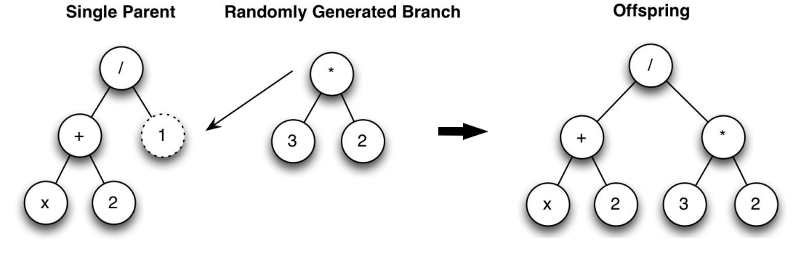

**2.2 交叉（Crossover）**

两个父体基因的混合/交换。常用的一种子树(subtree) crossover过程：在每一个父体中随机选择一个杂交点(crossover point)，复制第二个父体中以杂交点为根节点的子树，将一父体杂交点下的子树替换为二父体下的子树，生成子体。

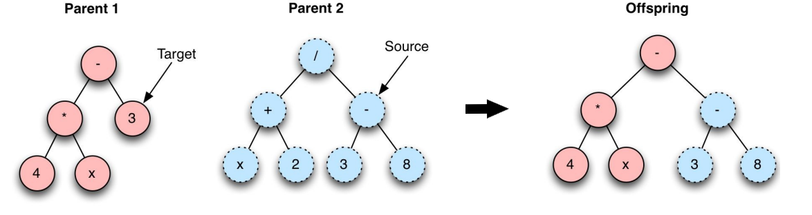

子树crossover由两个父体随机生成了一个子体。其他多种交叉/杂交方法中，也存在由两个父体生成两个子体的种类，如one-point crossover

### 三、通用框架

1990年左右提出的Fuzzing测试流程：受遗传编程（GP）启发，生成器/变异器通过某种方案生成输入，监控程序检测目标程序是否产生bug，以此为反馈作用于变异器。

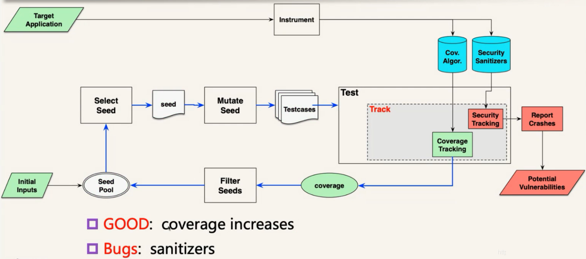

常见的配置：
- 适应度和进化指标均为边覆盖率(Edge Coverage)，遗传算子采用变异和交叉。
- 如果一个输入提高了边覆盖率，称为good种子。
- 采用插桩作边覆盖率的统计。
- Sanitizer作程序的安全跟踪。

### 四、分类

模糊测试按照应用场景分类：
1. 黑盒模糊测试：最简单的方法，只需要不断构造输入判断是否产生bug。
2. 灰盒模糊测试：最常用的方法，通过对目标程序进行静态插桩、动态插桩，在模糊测试过程中根据覆盖率的反馈来调整变异。
3. 白盒模糊测试：通常结合静态代码分析和动态执行路径分析，可以针对特定的代码路径、函数调用和数据处理逻辑设计测试用例，以探索更深层次的漏洞和错误。

## 测试输入

### 一、种子池管理

#### 1.种子选择

在模糊测试过程中，调控模糊算法的行为通过设置一系列配置参数来实现是一种常见做法[^2]。特别地，在基于变异的模糊测试中，所使用的种子文件有广泛的选择范围。例如，在对一个接收MP3文件的MP3播放器进行模糊测试时，从无限的有效MP3文件中选择合适的种子文件变成了一个挑战，这就是所谓的种子选择问题。

为了解决这个问题，研究人员开发了多种方法和工具。一个常用的策略是寻找能最大化特定覆盖度量（如节点覆盖率）的最小化种子集合，这个过程被称为计算minset。例如，如果一个配置集合C包括了种子文件s1和s2，它们覆盖了不同的程序地址。如果第三个种子文件s3能够覆盖s1和s2的所有地址，并且执行效率相当，那么仅使用s3进行测试将是更理想的选择，因为它能在更短的时间内测试更多的程序逻辑。这一理论得到了米勒研究的支持，该研究表明，代码覆盖率每提高1%，漏洞发现率就会增加0.92%。此外，这种策略还可以作为测试过程中的一个反馈更新机制，特别适合于那些可以持续添加新种子的模糊测试工具。

在实际应用中，模糊测试工具采用了多种覆盖度量标准。例如，AFL根据分支覆盖率来定义minset，并使用对数计数器来区分不同的分支。而Honggfuzz则通过执行指令数、分支数和独立基本块数来衡量覆盖率，这使得测试器可以将执行时间较长的路径考虑进minset，有助于发现服务拒绝或性能相关的问题。

#### 2.种子去重

去重在模糊测试过程中发挥着至关重要的作用，其目标是剔除那些触发同一错误的重复测试用例，从而形成一个能揭示独特错误的测试用例集合。这一步骤不仅有利于节约磁盘空间和资源，而且帮助用户更加轻松地识别和分析不同的错误类型，特别是对于那些仅对可能导致可靠利用的严重漏洞感兴趣的攻击者而言，这一点尤为重要。

目前广泛采用的去重技术有三种：

 **1）基于栈回溯哈希去重：** 这种方法通过捕获崩溃时的调用栈回溯和分配栈哈希来实现去重，其实现细节可能包括不同的栈帧数量和信息量。为了提升效率，某些实现会产生一个主要哈希和一个更精确的次级哈希。

 **2）基于覆盖率去重：** 工具如AFL通过源代码插桩来记录测试用例发现的新路径或者未覆盖的已知崩溃路径，把这类崩溃当作独一无二处理。

 **3）基于语义感知去重：** RETracer利用逆向数据流分析技术从崩溃事件中提取语义信息以进行分群，分析崩溃转储来审查导致崩溃的指针，识别出触发错误的具体指令，目标是识别并将崩溃归类到负责的最高级别函数。

#### 3.种子裁剪

种子文件的大小对模糊测试的效率有直接影响，其中较小的种子文件能显著降低内存消耗并提高测试的吞吐量。因此，减小种子文件大小的过程，即种子修剪，成为了模糊测试准备阶段的一个重要环节。这个过程可以在模糊测试的预处理阶段、测试循环开始之前，或作为测试过程中的配置更新环节进行。

AFL是一个著名的模糊测试工具，它应用种子修剪技术，通过迭代使用与代码覆盖率相关的工具来修剪种子，确保修剪后的种子保持了相同的覆盖范围。Rebert等研究者的成果进一步证实了种子修剪的有效性，他们发现使用最小尺寸算法选出的小种子，相比随机选取的种子，能更有效地降低唯一错误的发生率。特别是在针对Linux系统调用处理程序的模糊测试中，MoonShine工具对syzkaller进行了扩展，实现了在保持静态分析识别出的调用依赖性的同时减少种子文件的大小。

#### 4.调度算法

在模糊测试的领域内，调度是一个决定下一轮模糊测试迭代将采用哪些配置的过程，这些配置的具体内容取决于使用的模糊测试工具。简单的模糊测试工具，比如zzuf，在默认模式下仅使用一个配置，几乎不涉及调度选择。而更复杂的模糊测试工具，如BFF和AFLFast，其成功在很大程度上归功于它们采用的创新调度算法。本文着重讨论针对黑盒和灰盒模糊测试的调度算法；对于涉及更复杂配置的白盒模糊测试调度，可以参阅专门的文献进行深入了解。

调度问题的定义：调度策略旨在利用现有配置信息选择最有可能产生优秀结果的配置，这可能是指发现更多的独特漏洞或达到更全面的输入集合覆盖。每个调度策略都需要在**探索explore**（获取更多信息以指导将来的决策）和**利用exploit**（集中使用当前最有效的配置进行测试）之间寻找一个平衡点。Woo及其团队将这种平衡的追求称为模糊配置调度问题（Fuzz Configuration Scheduling, FCS）。

### 二、通用变异

在覆盖率统计过后，interesting的testcase会被保留，等待下一轮的变异。通用的变异分为三类：
1. 确定性变异deterministic
2. 破坏性变异havoc
3. 拼接splicing

#### 1.确定性变异deterministic

包括在测试用例的内容上进行单个的确定性变异。

**1.1 位翻转**

STAGE_FLIP1 每次翻转一位(1 bit)，按一位步长从头开始。
STAGE_FLIP2 每次翻转相邻两位(2 bit)，按一位步长从头开始。
STAGE_FLIP4 每次翻转相邻四位(4 bit)，按一位步长从头开始。
STAGE_FLIP8 每次翻转相邻八位(8 bit)，按八位步长从头开始，也就是说，每次对一个byte做翻转变化。
STAGE_FLIP16每次翻转相邻十六位(16 bit)，按八位步长从头开始，每次对一个word做翻转变化。
STAGE_FLIP32每次翻转相邻三十二位(32 bit)，按八位步长从头开始，每次对一个dword做翻转变化。

**1.2 加减法**

arith 8/8，每次8bit进行加减运算，8bit步长从头开始，即对每个byte进行整数加减变异；
arith 16/8，每次16bit进行加减运算，8bit步长从头开始，即对每个word进行整数加减变异；
arith 32/8，每次32bit进行加减运算，8bit步长从头开始，即对每个dword进行整数加减变异；

**1.3 兴奋值进行整数代换**

interest 8/8，每次8bit进行加减运算，8bit步长从头开始，即对每个byte进行替换；
interest 16/8，每次16bit进行加减运算，8bit步长从头开始，即对每个word进行替换；
interest 32/8，每次32bit进行加减运算，8bit步长从头开始，即对每个dword进行替换；
以interest32/8为例：
``` c
#define INTERESTING_32 \
  -2147483648LL, /* Overflow signed 32-bit when decremented */ \
  -100663046,    /* Large negative number (endian-agnostic) */ \
  -32769,        /* Overflow signed 16-bit                  */ \
   32768,        /* Overflow signed 16-bit                  */ \
   65535,        /* Overflow unsig 16-bit when incremented  */ \
   65536,        /* Overflow unsig 16 bit                   */ \
   100663045,    /* Large positive number (endian-agnostic) */ \
   2147483647    /* Overflow signed 32-bit when incremented */
```
**1.4 字典**

会把用户提供的token替换、插入到原文件中。

#### 2.破坏性变异havoc

变异是随机叠加的，还包括改变测试用例的大小（例如添加或删除部分输入）。

#### 3.拼接splicing

将两个差异明显的测试用例，各切一半，合并为一个，并执行破坏性变异。

25 Years of Fuzzing https://www.fuzzing.io/Presentations/Lightning-FuzzCon2020.pdf

radamsa的输入生成算法：
● ab: enhance silly issues in ASCII string data handling
● bd: drop a byte
● bf: flip one bit
● bi: insert a random byte
● br: repeat a byte
● bp: permute some bytes
● bei: increment a byte by one
● bed: decrement a byte by one
● ber: swap a byte with a random one
● sr: repeat a sequence of bytes
● sd: delete a sequence of bytes
● ld: delete a line
● lr2: duplicate a line
● li: copy a line closeby
● lr: repeat a line
● ls: swap two lines
● lp: swap order of lines
● lis: insert a line from elsewhere
● td: delete a node
● tr2: duplicate a node
● tr: repeat a path of the parse tree
● uw: try to make a code point too wide
● ui: insert funny unicode
● num: try to modify a textual number
● xp: try to parse XML and mutate it
● ft: jump to a similar position in block
● fn: likely clone data between similar positions
● fo: fuse previously seen data elsewhere

小函数多次调用的优化：
- 函数内联化
- 函数指针数组 / 查找表
- SIMD 向量化，并行运算

### 三、REDQUEEN

REDQUEEN探索了绕过困难比较和(嵌套)校验和检查的方案，但不使用诸如污点跟踪或符号执行之类的昂贵技术。该模糊测试方案专注于Input-to-State（I2S）的比较[^3]，这是一种与至少一个操作数中的输入直接相关的比较类型。作者表明，许多障碍都是这种类型的，并开发了一种定位和绕过它们的技术。

I2S关联的例子如下图所示。对cmp指令进行hook，运行指令时可以观察到eax的值为VALU，0x44434241则为ABCD(均为小端序)。

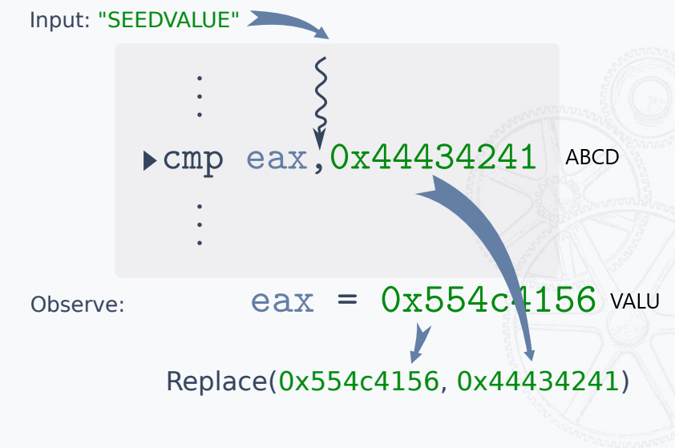

input中同样有VALU出现，由此推断：如果将输入中的VALU替换为ABCD，就有较大可能绕过这个障碍。

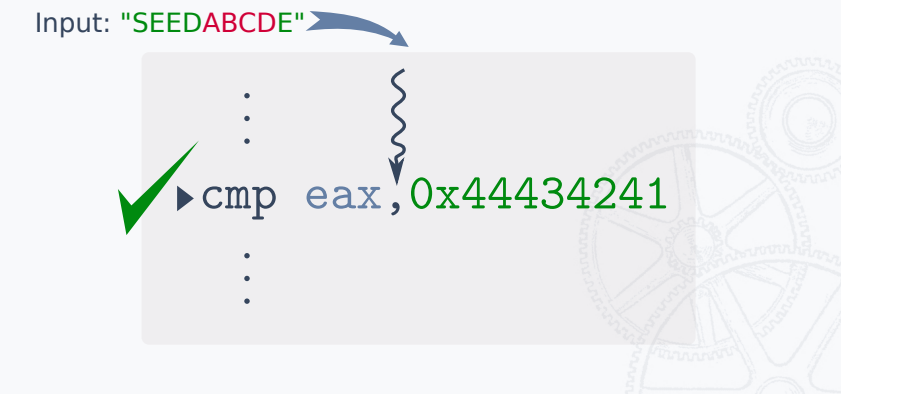

## 反馈策略

### 一、插桩

插桩技术[^4]是在程序中插入探针和代码段，来收集运行时的信息，常用于安全测试和动态代理。例如Fuzzing、DTA、ASAN都使用插桩来实现相应的功能。在Fuzzing中，插桩的目的是统计边覆盖率信息，反馈指导后续的测试过程根据插桩的方式和目标的不同，插桩技术可以分为3种：
1. 源码插桩，在已知源码的情况下进行插桩。这种情况下不必考虑重定位的问题，根据编译器技术的不同，有汇编级别插桩(如afl-as)和编译器级别插桩(如LLVM pass)两种方式。
2. 静态二进制插桩，需要考虑重定位的问题，使用二进制重写技术来永久修改磁盘上的二进制文件。
3. 动态二进制插桩，DBI不修改磁盘上的二进制文件，而是在二进制文件执行时监视它们的进程，并在指令流中动态插入新指令。这种方法的优点是避免了代码重定位问题，因为：插入代码只注入到指令流中，而不注入到内存中二进制的代码段中，因此它不会破坏引用。

#### 1.源码插桩

**1.1 汇编级别**

使用的是trampoline（跳板）方案，在重定位生成PIE文件之前，在汇编文件的.text节中的每个基本块中插桩。因此，需要检测函数名或条件标签：
1. main函数，入口点。
2. .L<whatever>，GCC跳转标签。
3. .LBB0_0，只在clang模式下的跳转标签。
4. jnz foo，以jnz为例的条件分支。

插入的代码trampoline相当于一个inline函数，该函数的工作：
1. 调用函数生成随机数，作为基本块的标识符和参数
2. 传递给记录边覆盖率的函数

**1.2 编译器级别(LLVM模式)**

LLVM是编译器后端，常搭配clang等前端使用，LLVM Pass 是一些中间过程处理 IR 的可以用户自定义的内容，可以用来遍历、修改 IR 以达到插桩、优化、静态分析等目的。

llvm_mode可以实现编译器级别的插桩，可以替代汇编级别使用的比较粗暴的汇编级别的重写方法，且具备如下几个优势：
1. 编译器可以进行很多优化以提升效率；
2. 可以实现CPU无关，可以在非 x86 架构上进行fuzz；
3. 可以更好地处理多线程目标。

#### 2.静态二进制插桩

SBI需要对二进制程序反汇编，然后按需添加插桩代码，更新二进制程序存入磁盘。首先来看最朴素的插桩方法，如下图所示。假设要对mov edx，0x1指令插桩，可以使用jmp指令将其覆盖，跳转到插桩代码。在插桩代码中：对寄存器状态进行保存，执行mov edx，0x1和标记代码(用来统计覆盖率等)，恢复寄存器状态，返回到正常指令。

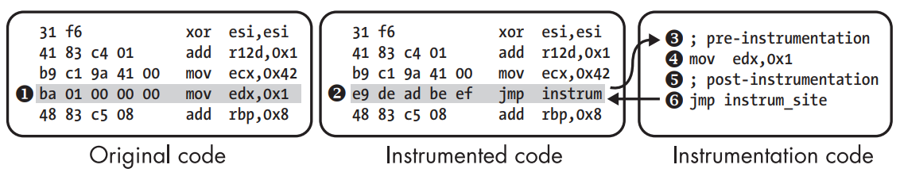

这种方法有两个问题：首先jmp instrum指令是5个字节，如果插桩目标指令小于5字节，会出现覆盖下一条指令的问题；第二，插桩目标指令与标记代码一起执行，会造成寄存器状态的混乱。

因此，SBI需要处理重定位问题，有两种常用的方法：int3和跳板trampoline。
1. int3方案，使用x86的int 3指令，调试器用其实现软件断点，SBI库同样可以捕捉SIGTRAP信号，通过ptrace找到中断的地址，从而获取插桩点地址。相比于使用jmp覆盖原来的指令，使用int 3指令来覆盖只有1个字节0xcc，后面可以填充nop平衡相对地址。缺点是：int 3软件中断时间开销大；如果程序本身有很多int 3指令，会和插桩的int 3指令相混淆。
2. 跳板(trampoline)方案，是简单方法的改进，以函数为单位进行插桩。创建所有函数的副本，放在新的代码段.text.instrum中；用jmp指令覆盖原始函数的第一条指令，使其跳转到副本函数。后面使用垃圾字节平衡相对地址。同时，在副本函数中，可以在每条可能的插桩目标指令前插入若干nop指令，方便使用call覆盖跳转到标记代码；为了相对寻址的正确性，重写所有寻址指令。例如，需要对ret指令进行标记，则在ret前覆写指令call hook_ret，hook_ret是标记函数，可以由SBI的动态库提供。在hook_ret中保存寄存器状态，运行相关指令，恢复寄存器状态。

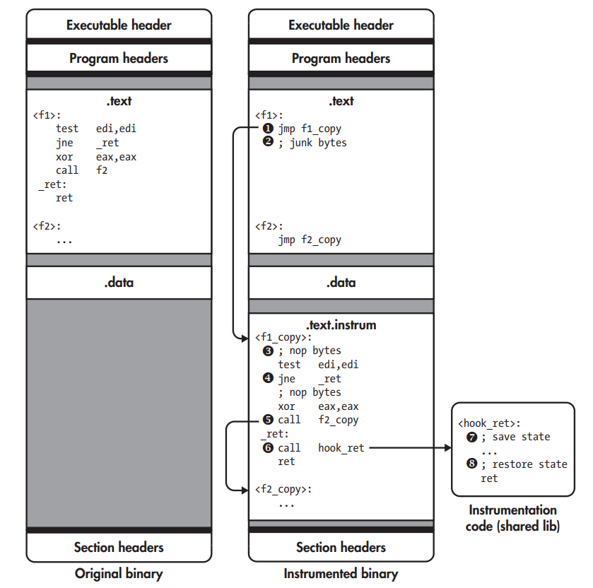

上面的方案适合于直接调用、直接跳转和间接调用。对于间接跳转，以switch的汇编实现为例，需要修改跳转表中case地址，指向副本中的case。

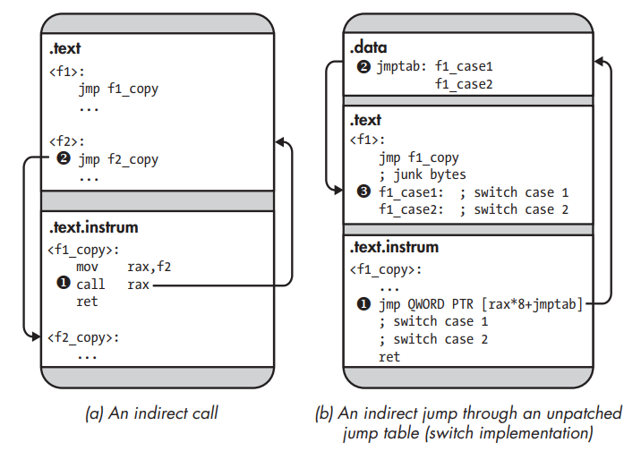

缺点是：复制了所有函数，使得二进制程序占用空间增大；间接跳转需要额外的工作；对于内联数据，可能造成对数据的覆盖。最后，SBI的正确性都建立在反汇编的正确性上，如果反汇编有问题，一切修改都会破坏原来的二进制程序。

#### 2.动态二进制插桩

DBI通过监视和控制所有执行的指令来动态插桩进程，不会出现SBI的各种问题，在现代平台上也不比SBI慢太多。
一个DBI系统有很多组成部分，如下图所示。在操作系统上，虚拟机用来实现在指令流中动态插入新指令，而不会破坏主机内存中的进程。DBI工具用来启动DBI系统、与插桩引擎交互。

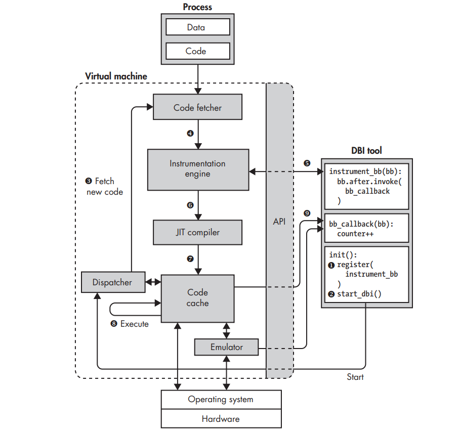

1. DBI工具向DBI系统注册函数instrument_bb，DBI引擎依此对基本块插桩。
2. 初始化函数启动DBI系统。
3. 最初代码缓存是空的，DBI系统从进程中提取代码。
4. DBI系统对其进行插桩。
5. 插桩是根据instrument_bb函数。
6. 插桩后，DBI系统调用JIT编译器编译代码，将机器码编译成机器码，并重新优化插桩。
7. 编译后的代码存储在代码缓存中。
8. 大多数指令在代码缓存中直接执行，特殊处理的系统调用等指令使用仿真器进行仿真。
9. 被插桩的代码基本块在执行时，会调用插入的bb_callback函数，以便DBI系统对基本块的覆盖率统计。

新的代码基本块的插桩和编译只在第一次执行时需要，后续在代码缓存中被重用。

以AFL的QEMU模式为例，与LLVM模式的源码插桩不同，QEMU模式[^5]基于动态翻译进行了动态二进制插桩(DBI)。以AFL的实现为例，AFL对QEMU进行了patch来实现DBI，相关patch在AFL-master/qemu_mode/patches。
elfload.diff：在QEMU加载elf文件时，获取入口点地址、代码段起始地址、代码段结束地址，三个变量定义在afl-qemu-cpu-inl.h中。
``` c
abi_ulong afl_entry_point, /* ELF entry point (_start) */
          afl_start_code,  /* .text start pointer      */
          afl_end_code;    /* .text end pointer        */
```
cpu-exec.diff：afl-qemu向qemu的cpu-exec.c中加入了两个宏函数AFL_QEMU_CPU_SNIPPET1和AFL_QEMU_CPU_SNIPPET2。在qemu进程执行一个翻译块tb之前都要调用宏函数AFL_QEMU_CPU_SNIPPET2。

``` c
#define AFL_QEMU_CPU_SNIPPET2 do { \
    if(itb->pc == afl_entry_point) { \
      afl_setup(); \
      afl_forkserver(cpu); \
    } \
    afl_maybe_log(itb->pc); \
  } while (0)
```

如果当前tb指向入口地址，说明是运行的开始。此时qemu进程调用afl_setup来初始化覆盖率位图的共享内存。调用afl_forkserver成为forkserver，同时成为qemu父进程。

qemu父进程循环fork出qemu子进程，qemu子进程信息传递给afl-fuzz。调用afl_wait_tsl接收qemu子进程的翻译块信息：保存tb的PC寄存器、代码段基址和CPU状态(这些信息保存在afl_tsl结构体中)，如果该块不在cache中，调用tb_gen_code翻译它加入cache，让后续fork出的子进程继承cache，避免重复翻译。
``` c
struct afl_tsl {
  target_ulong pc;
  target_ulong cs_base;
  uint64_t flags;
};
```

qemu子进程退出afl_forkserver继续执行，调用afl_maybe_log 记录本次翻译块的覆盖率信息(qemu模式以翻译块的pc作为基本块标识符，而非随机数)，然后退出宏函数回到cpu-exec继续执行下一个翻译块。与afl_wait_tsl相对应的，当没有翻译块可用时，需要生成新块，并调用宏函数AFL_QEMU_CPU_SNIPPET1，调用afl_request_tsl填充afl_tsl结构体发送给qemu父进程。

``` c
#define AFL_QEMU_CPU_SNIPPET1 do { \
    afl_request_tsl(pc, cs_base, flags); \
  } while (0)
```

### 二、统计

可将覆盖率信息的概念理解为汇编代码中的某条边/某个函数/某个基本块是否已执行。其计量方式很多，但无论是GCC的GCOV还是LLVM的SanitizerCoverage，都提供三种级别的覆盖率检测：
- 函数（function）
- 基本块（basic-block）
- 边（edge）

以边级别的覆盖率信息作为反馈为例，插桩代码的store函数负责统计覆盖率信息，存储到Fuzzer开辟的共享内存（hash表）中。覆盖率统计流程分以下三步：
1. 使用之前设置的基本块 `BB` 的标识符与上一个基本块 `BB_prev` 的 标识符异或运算，代表边 `BB_prev->BB`。
2. 当前基本块的标识符通过shr运算，右移1位(目的是对于A->A和A->B、B->A这三种情况进行区分)赋值到新的 `BB_prev`。
3. 在统计覆盖率信息的hash表中将该边的计数加0x01，adc指令将CF上的进位值也相加，达到NeverZero的目的。

``` c
cur_location = <COMPILE_TIME_RANDOM>;
shared_mem[cur_location ^ prev_location]++; 
prev_location = cur_location >> 1;
```

此计数被粗粒度地分桶统计，如下列桶所示。
```c
[0]           = 0,
[1]           = 1,
[2]           = 2,
[3]           = 4,
[4 ... 7]     = 8,
[8 ... 15]    = 16,
[16 ... 31]   = 32,
[32 ... 127]  = 64,
[128 ... 255] = 128
```
如果一个输入执行的边以一个新桶来统计，则被认为是interesting的，保存到队列中。这些桶或称命中计数(hitcount)在执行期间被记录到一个共享位图(bitmap)中，其中每个字节代表一个边的计数。

由于位图的大小是有限的(64KB)，所以当一个程序的边数大于2^16时会发生碰撞，同时由于统计边时的映射方式同样可能存在碰撞。

### 三、反馈

当有新的边 (BB->BB)出现或记录的边出现新的命中桶则视为产生新状态，每次执行程序后，对比位图有无产生新状态来决定是否保存测试用例。

## 迭代测试

要达到迭代测试，需要配置好四个组成部分：
1. fuzzer进程，由主程序启动生成。
2. 测试进程，由主程序创建好管道后，fork生成。
3. 覆盖率统计，共享内存存储反馈信息。
4. 测试输入传递和反馈。

目前，常见的两种机制来支持快速的循环测试：forkserver、持久模式。

### 一、forkserver

forkserver是一种机制，为了避免调用fork启动被测程序，还需要调用execve加载被测程序导致的额外开销。

#### 1.forkserver的初始化

第一次生成测试进程时，由于是第一次运行到插桩代码，检测到了forkserver未启动，它则作为forserver，以后都是从被测程序自己fork，这样省略了execve开销。
由于测试进程是fork出来的，继承了覆盖率信息的共享内存ID，调用shmat将返回地址存储在全局指针中，所以测试进程的覆盖率信息fuzzer可以直接访问到。

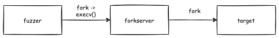

#### 2.forkserver传递信息

forkserver作为fuzzer和target的桥梁，调用pipe函数传递以下两种信息：
1. 测试用例。
2. 测试进程的状态。

forkserver从fuzzer接收测试用例，再将测试用例输入测试进程，开始模糊测试，在测试进程结束时有两种状态：
1. normal，测试进程正常退出，forkserver将状态反馈，fuzzer根据覆盖率信息的变化确定是否interesting。
2. abort，测试进程崩溃了，forkserver将状态反馈，fuzzer记录下该crash。

由此，测试进程作为forkserver循环执行fork操作，并将子进程的结束状态通过状态管道传递给fuzzer进程。

### 二、持久模式

正常情况下，对于每一个测试用例，都会fork()出一个新的目标进程进行处理，而大量fork()无疑会带来大量开销。为此，将一个loop patch到测试目标中，每次fork()得到的进程，会对一批而非单个测试用例进行处理，从而减少了开销，提高了执行速度。

#### 1.LLVM持久模式

使用宏定义 LOOP(NUM) 来决定单进程处理多少测试用例。需要注意的是每次fuzz过程都会改变一些进程或线程的状态变量，因此，在复用这个fuzz子进程的时候需要将这些变量恢复成初始状态。

#### 2.QEMU持久模式

此模式最高可以达到10倍加速，因此建议尽可能使用此模式。有两种主要方法可以实现此目的：
1. 循环一个函数：用户指定一个函数的地址，通常是harness函数的偏移值，模糊器会自动在while(LOOP(NUM))循环中使用该函数，修改其返回地址。该地址也可以不是函数的第一条指令，但是在这种配置下，用户必须提供栈上的偏移量，以正确定位要修改的返回地址。
2. 入口点和出口点：用户可以指定循环的第一条指令和最后一条指令的地址，QEMU将在运行时修改代码以在这些地址之间生成循环。

## 漏洞检测

### 一、内存漏洞Sanitizer

sanitizer是目前主流的漏洞挖掘辅助技术，取代DTA搭配模糊测试可以达到很好的效果。sanitizer会在运行时检测漏洞，并对其进行分类。主流编译器GCC、LLVM和MSVC都支持该特性。sanitizer的特点是：若是程序没有任何问题，不会返回错误消息；而当一个程序有多个漏洞触发时，会在第一个漏洞发生后停止。

google的sanitizer项目包括很多子项目，包括有ASAN、MSAN、UBSAN、TSAN、KASAN、QASAN等等。

#### 1.ASAN

AddressSanitizer (简称 ASAN) 是C/C++的内存错误检测器[^6] ，它可以发现以下漏洞：
1. Use after free (dangling pointer dereference)
2. Heap buffer overflow
3. Stack buffer overflow
4. Global buffer overflow
5. Use after return
6. Use after scope
7. Initialization order bugs

ASAN非常快速. 对插桩后的程序平均降速~2x，ASAN从LLVM 3.1和GCC 4.8开始是其一部分。使用ASAN需要参数 -fsanitize=address. 添加 -O1或更高来获得合理的表现，添加 -fno-omit-frame-pointer开启栈帧获得更好的栈跟踪。

ASAN包括一个编译器插桩模块和一个替代malloc函数的运行时库。ASAN 的运行时库会使用__asan_malloc来替换掉所有对 malloc 的调用。需要注意的是，目前版本ASAN还不能对jemalloc、tcmalloc等非调用libc的内存管理函数进行替换，所以编译插桩时可以需要参数 `MALLOC=libc`。

区别基于DTA的内存泄露检测，ASAN采用的是检测redzone的方法，优点是在检测越界访问的同时可以检测内存泄露，缺点是无法溯源。

**1.1 插桩模块**

对于每个内存读写指令，进行编译时插桩。IsPoisoned检查被访问的内存是否是可访问的(即not poisoned)，内存是否poisoned的元信息保存在影子内存中。

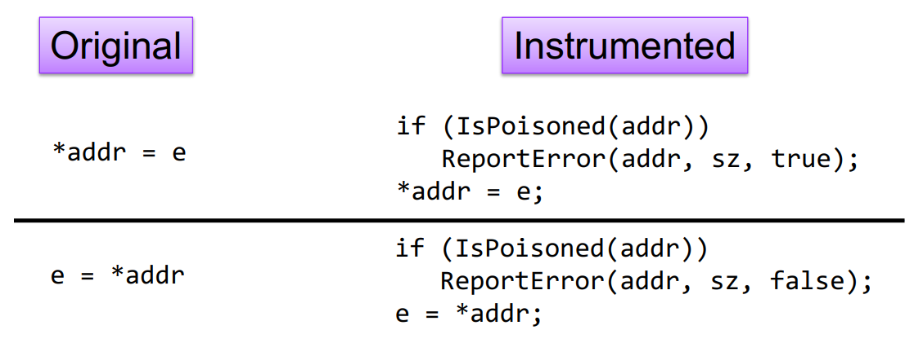

对内存的访问可以分为：栈访问和堆访问，二者都需要在分配的内存周围插入redzone，对redzone进行poison。然后插桩后的内存访问指令再通过IsPoisoned检查。

**1.2 运行时库**

堆访问通过替代malloc调用为__asan_malloc来实现。redzone的插入使用malloc，poison和元信息保存由封装的函数Poison和UnPoison实现。

``` c
void *__asan_malloc(size_t sz) {
    void *rz = malloc(RED_SZ);  // redzone
    Poison(rz, RED_SZ);
    void *addr = malloc(sz);    // 分配的内存
    UnPoison(addr, sz);
    rz = malloc(RED_SZ);        // redzone
    Poison(rz, RED_SZ);
    return addr;                // 返回分配的内存首地址
}
```

对于free的内存进行poison，动态调整redzone的区域。

**1.3 栈访问**

栈访问需要插入若干高级语言代码来实现。以下面的函数foo为例：
``` c
void foo(){
   char a[8]
   //some code
   return;
}
```
插入高级语言代码后：
``` c
void foo_instrumented(){
   char redzone1[32]; // 32-byte aligned
  char a[8]; // 32-byte aligned
  char redzone2[24];
  char redzone3[32]; // 32-byte aligned
  int *shadow_base = MemToShadow(redzone1);
  shadow_base[0] = 0xffffffff; // poison redzone1
  shadow_base[1] = 0xffffff00; // poison redzone2, unpoison 'a'
  shadow_base[2] = 0xffffffff; // poison redzone3
  //some code
  shadow_base[0] = shadow_base[1] = shadow_base[2] = 0; // unpoison all
  return;
}
```
区别于free操作，在函数最后unpoison栈空间。

**1.4 影子内存**

MemToShadow函数返回内存地址shadow_base=addr>>3+0x20000000，从栈的shadow_base操作可以看到，对于1个字节的内存的poison/notpoison情况，使用1个bit来表示。

#### 2.TSAN

TSan 用来检查数据争用(data race)、死锁(deadlock)。当多个线程同时操作同一个变量的时候，而至少一个的操作是写操作时，就会发生数据争用；当多个线程因争夺资源而造成的一种互相等待的情况，若无外力介入，它们都无法继续推进，就是死锁。

TSan 需要所有代码都以 -fsanitize=thread 编译参数进行编译。在编译时，TSan 会在每一个内存存取操作、函数的调用、函数的 entry 和 exit 进行插桩。

多线程程序的执行过程中，数据竞争可能引发竞态条件漏洞。TSAN检测数据竞争使用happens-before方法。TSAN检测数据竞争使用的该方法。在两个事件中， 在一个事件发生前能够确定另外一个事件的结果，则称 两个事件满足 happens-before 关系。如果在 程序执行过程中任意两个操作都满足happens-before关 系则认为不存在竞态漏洞，反之则认为存在。

如下图所示，当一个线程对共享资源 v 的操作使用了锁，并且在之后一个 不同的线程中对共享资源 v 再次申请了锁并且使用完 后释放，那么率先使用锁对共享资源 v 操作的线程和后 续使用锁的线程满足 happens-before 关系。通过设置 happens-before 规则，在每个多线程进程中检测任意两 个操作之间是否满足happens-before关系。

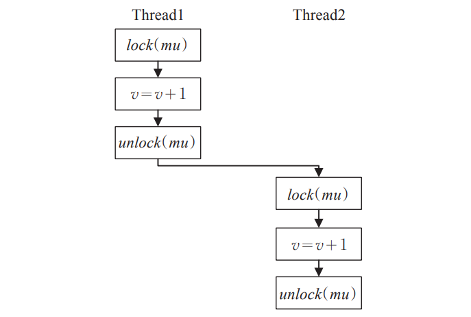

如果存在两个操作不满足 happens-before 关系，则判定存在竞态漏洞。因为happens-bofore方法能够确保所有操作之间不会存在结果不确定的情况，所以 happens-before 方法误报率低。

#### 3.类型混淆检测

CaVer、TypeSan与HexType：专注于侦测C++中的不当类型转换，比如错误地把基类对象转换为派生类对象。

### 二、Web漏洞Sanitizer

KameleonFuzz：专门侦测跨站脚本（XSS）攻击的工具，通过解析真实Web浏览器中的测试用例、提取DOM树，并与XSS攻击模式比较，来识别成功的XSS攻击。

µ4SQLi：采用类似技术侦测SQL注入。鉴于难以从Web应用响应中可靠侦测SQL注入，它通过数据库代理拦截Web应用与数据库间通信，检查输入是否触发有害行为。

### 三、poc最小化

测试用例最小化是模糊测试分流过程中的关键步骤，其主要目标是识别并减简能够触发错误的测试用例，从而创造出能触发相同错误的更小且更精简的原始测试用例版本。虽然它在减小输入规模的目的与种子修剪相仿，但测试用例最小化更侧重于根据错误指示进行最小化处理。

各种模糊测试工具实施了不同的实现方式和算法以进行测试用例最小化。如，BFF利用了一个为模糊测试特制的最小化算法，目的是尽量减少与原始种子文件之间的差异。AFL也提供了测试用例最小化功能，通过将字节置零和缩减测试用例的长度来实现测试用例的简化。进一步，Lithium是一种通用的测试用例最小化工具，旨在通过指数级减小尺寸，移除测试用例中的连续行或字节“块”，非常适合处理由脚本模糊测试生成的复杂测试用例。

除了专为模糊测试设计的工具之外，还存在适用于模糊测试发现的测试用例的通用缩减工具，如适用于多种格式的格式无关技术delta调试，及针对特定格式的专用技术，例如CReduce是专门用于C/C++文件的。虽然这些专用技术在处理文件类型上受限，但由于它们能够理解目标语法，通常比通用技术更高效。

## 有用的经验

1. 该测试工具显示出现了崩溃情况，但当我将待测试系统（SUT）按照测试用例的要求在测试工具之外进行运行时，却未发现有任何崩溃现象。发生了什么？
- 有以下几个可能的原因：1）该系统单元（SUT）的行为存在不确定性。2）该系统单元依赖于全局状态（例如，它可能读取或写入磁盘或使用内存中的单例对象）。3）您正在遇到崩溃的情况，因为您的系统内存不足并终止了进程。这通常在 Linux 系统中通过信号 6 来表示。您还可能想要查看 dmesg 的输出，看看是否有关于内存不足问题的记录。
2. 我何时该停止进行模糊测试呢？
- 模糊测试工具连续几个小时都没有找到新的测试用例时，就停止进行模糊测试。这相当于说，该测试工具的覆盖率并没有增加。
- 根据我们在 Trail of Bits 的经验，我们建议进行多次模糊测试活动，定期重置测试数据集，并检查覆盖率是否有所变化。
3. 我应该对这个语料库保密还是公开呢？
- 默认情况下，您应当对语料库保密。该语料库是一项宝贵的资源，其生成过程需要耗费大量精力。如果向攻击者提供该语料库，他们可能会更容易发现其中的漏洞。然而，有一些项目，比如 OpenSSL，决定将其语料库公开。这样做可能的原因是为了支持安全研究人员。此外，这也简化了在持续集成环境中使用该语料库进行模糊测试的设置过程。
4. 我的模糊测试工具没有检测到任何问题。有哪些迹象表明模糊测试设置可能存在漏洞呢？
- 请查看在进行模糊测试时所达到的代码覆盖率情况。代码覆盖率的一个衡量指标可以是每秒的执行次数：1）如果每秒的执行次数过多（超过 10⁶ 次），那么关键代码很可能没有正常执行，代码覆盖率可能也较低。测试对象可能在早期就出现了错误并进行了优雅的返回。2）如果每秒的执行次数过少（少于 100 次），那么您的目标可能执行速度过慢，而模糊测试器也未能足够迅速地发现有趣的测试用例。
5. 我的语料库已经变得相当庞大。我该如何处理这些数千个小型文件呢？
- 有一种叫做“语料库精简”的技术。
6. 我的测试工具发现了会导致系统崩溃的输入数据。然而，这个工具非常庞大且复杂。有没有什么方法可以简化对导致崩溃的根本原因的查找过程呢？
- 有一种名为“测试用例最小化”的技术，它能够减少输入数据的量，同时仍能保证程序不会崩溃。
7. 在进行模糊测试活动期间或之后，我如何能够收集崩溃时产生的核心转储文件呢？
- 查阅各种工具的实现。
8. 我有一个模糊测试设置。我应该多久以及在何处运行我的测试工具？
- 理想情况下，您应在专用服务器上持续进行模糊处理，并在您正在使用的持续集成服务中也进行同样的操作。
9. 我的测试工具检测到了多次崩溃情况。实际上，我已经有数百个崩溃记录文件了。那我该如何找出对应的错误呢？
- 确定具体错误的过程被称为“错误分类”。

[^1]: Genetic Programming: An Introduction and Tutorial, with a Survey of Techniques and Applications https://wiki.eecs.yorku.ca/course_archive/2011-12/F/4403/_media/gp1.pdf
[^2]: The Art, Science, and Engineering of Fuzzing: A Survey https://arxiv.org/abs/1812.00140v4
[^3]: REDQUEEN https://www.syssec.ruhr-uni-bochum.de/media/emma/veroeffentlichungen/2018/12/17/NDSS19-Redqueen.pdf
[^4]: Practical Binary Analysis https://www.amazon.com/Practical-Binary-Analysis-Instrumentation-Disassembly/dp/1593279124
[^5]: QEMU mode https://github.com/AFLplusplus/AFLplusplus/blob/stable/qemu_mode/README.md
[^6]: ASAN Wiki https://github.com/google/sanitizers/wiki/AddressSanitizerAlgorithm