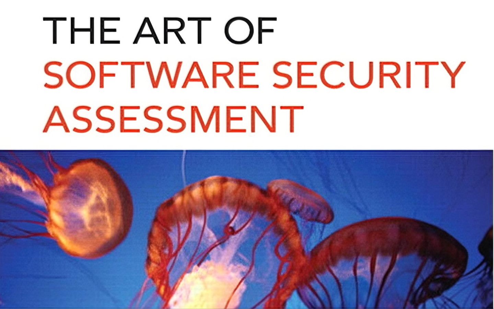

## 代码审计

代码审计通过分析程序源码或二进制码，识别潜在安全漏洞的系统化过程。深度理解代码，有助于学习漏洞模式、发现漏洞、新的攻击面。同时，在内存安全语言代码中，fuzzing受限，需要代码审计发现逻辑漏洞。
1. 学习1day，在补丁对比和逆向工程的辅助下，定位漏洞，学习1day。
2. 寻找攻击面，从海量代码中确定好测试的对象，比如特定函数、API接口，聚焦高风险区域，比如命令执行、文件解析。从中寻找新的攻击面，在此攻击面上执行模糊测试。

代码审计策略有多种，每种策略都包括4个元素[^1]，其中以污点分析为基础：
1. 起点（source）：代码审计的起点。
2. 终点（sink）：代码审计的目标，或者跟踪代码的终点。
3. 方法：代码审计的方法，比如，跟踪数据流、控制流。
4. 漏洞类型：针对的是什么类型的漏洞。

## 审计对象和目标

审计对象根据访问权限划分，有以下4种情况：
1. 仅源码：仅拥有源代码，不包含完整的编译和测试环境，而且无法构建出可运行的程序。这种情况只能使用静态分析的方式进行审计。
2. 仅二进制程序：仅拥有二进制文件。这种情况下通过动态分析以及逆向工程的方式进行审计。
3. 有源码及二进制程序：既拥有源代码，也拥有一个可运行的二进制程序。
4. 完全黑盒：既没有源代码，也没有可运行的二进制程序，这在 Web 应用中较为常见，只能通过外部接口进行盲测。

同时，指定审计的目标。
1. 对于安全研究人员，目标是在最短的时间内找到最有价值的漏洞。
2. 对于商业安全顾问，目标是在项目预算允许的范围内，尽可能达到更高的审计覆盖率。
3. 对于开发者或者安全架构师，目标是花费更长的时间周期进行内部安全评审。

## 审计策略

常用的代码审计策略有3种：自顶向下、自底向上、见微知著。

### 一、自顶向下

#### 1.静态污点分析 STA

```
起点：数据入口点，比如函数的参数、环境变量等。
终点：最终的漏洞触发点，比如越权、注入、内存破坏等。
方法：通过跟踪用户的输入数据找到潜在的漏洞点。
漏洞类型：可被恶意输入触发的安全漏洞。
```

在审计过程中记录一系列传播的数据并进行跟踪，配合安全边界分析和常用的漏洞类型来定位漏洞。面对类似于 Java 或者 C++ 等语言的项目时候，跟踪原始输入会经过多个中间类，导致你打开了十几个文件之后还没有到达真正处理数据的代码，在这种情况下最好有设计文档的帮助。

#### 2.模块分析

假设模块以文件进行划分，因此实际上分析一个模块就是分析对应文件的源文件。比如redis模块就以文件划分，ACL相关代码存储在acl.c中。

```
起点：文件开头。
终点：文件末尾。
方法：阅读模块中的每个函数，记录潜在问题。
漏洞类型：所有类型。
```

模块分析的过程就是从头到尾阅读一个源码文件，并且不跟踪其中调用到的外部函数，也不关心当前函数的引用情况，只将目前遇到的问题记录下来。

#### 3.引用分析

引用分析和模块分析类似，区别在于聚焦的是代码中的类或者结构体实现。

```
起点：某个对象实现。
终点：所有对该对象的引用 (xref)。
方法：聚焦于对象引用的代码。
漏洞类型：接口使用导致的错误，类型混淆等。
```

### 二、自底向上

与一相反，该策略从可能导致漏洞的底层代码出发，反向追踪，来验证漏洞的触发路径。

#### 1.敏感调用

```
起点：潜在的漏洞点。
终点：任意用户可控的输入。
方法：指定一系列的敏感调用，反向分析这些调用是否构成可利用的漏洞。
漏洞类型：可被恶意输入触发的安全漏洞。
```

最简单的方式是通过正则表达式来指定敏感函数或者语句，通过文本搜索工具查找潜在漏洞并进行验证。这个策略的优点是针对已知的漏洞类型可以达到较高的覆盖率，比如格式化字符串、命令注入等。

#### 2.接口分析

区别于敏感函数，接口暴露于用户输入，也是可能存在漏洞的地方。

```
起点：接口函数
终点：任意用户可控的输入。
方法：指定一系列的接口函数，反向分析这些调用是否构成可利用的漏洞。
漏洞类型：可被恶意输入触发的安全漏洞。
```

### 三、见微知著

在经过前两类策略的审计后，已经对代码本身有了一定程度的理解，这时候就可以纵观全局，审计应用整体的设计和实现。这类策略关注上层的设计缺陷、逻辑漏洞，因此可以找到隐藏较深的严重漏洞。

#### 1.系统建模

完成具体实现的分析后再反向推断整体的的设计思路，然后根据这个推测的思路去找到一些未曾触及的组件实现。

```
起点：待审计模块的起点。
终点：安全漏洞。
方法：通过行为建模还原模块的抽象行为，并寻找潜在的逻辑和功能漏洞。
漏洞类型：所有类型。
```

通常只需要对一些核心模块进行反向建模，比如应用的安全子系统、输入过滤模块或者其他广泛使用的核心组件等。在建模的过程中，把自己放在开发者或者架构师的位置重新考虑模块的设计，通过系统建模来挖掘逻辑漏洞。

#### 2.安全边界

```
起点：所有安全相关的校验和检查代码。
终点：安全漏洞。
方法：通过已知的安全相关代码去推测还原目标的设计的安全边界。
漏洞类型：所有类型。
```

通过收集代码中的安全校验相关代码片段进行记录，然后对这些针对安全边界的检查进行分类整理，最后归纳出原始的安全层级划分。

#### 3.设计验证

如果有目标应用的设计文档或者规范手册，那么直观的审计策略就是通过对比规范和实现代码来查找其中的未定义行为或者冲突之处。

```
起点：模块的起点
终点：模块的末尾
方法：挖掘代码实现中和设计有出入的漏洞点
漏洞类型：所有类型
```

简单来说，设计验证是先推测和还原目标模块的主要功能和正常行为，然后再针对其中的临界情况进行重点审计。

## 审计技巧

### 一、故地重游

代码审计需要多次阅读，对于一段代码通常需要阅读多次才能找到其中所有类型的漏洞。
- 在第一遍审计中，可能主要关心整数溢出、内存管理或者格式化字符串相关的安全漏洞
- 第二遍的审计则主要关心功能性的实现，比如返回值检查和一些容易理解错误的API调用(如 strncpy、strlcpy)
- 第三遍则主要关心线程间潜在的同步、竞争问题或者TOCTOU的资源访问管理，等等。

### 二、审计笔记

笔记一方面可以帮助自己评估代码审计覆盖率，沉淀审计心得；另一方面也可以方便以后继续深入审计时可以快速回顾之前的工作。

此外，不论作为打工人还是独立安全顾问，我们都需要对老板或甲方输出审计报告或者漏洞报告，这些资料就是重要的数据来源。

### 三、想法列表

在代码审计过程中，可能会有很多想法，比如在审计某个状态机时会想到可能引入一些异常的状态切换导致处理异常，或者某些用户可控的数据进入了其他模块的分支中可能导致对应模块校验出错等等。

这些想法在审计过程中无法逐一去验证，否则就偏离了初始的审计规划。因此，需要维护一个潜在漏洞列表，记录上述想法，表示系统中“可能”出现漏洞或者被攻击者利用的点。这个列表不需要非常详细，可能只是一个猜测或者灵感。将其记录下来之后可以等到后续有时间继续深入分析和验证，这样既能保证审计工作有序推进，也能保证自己的想法不被遗忘。

[^1]: The Art of Software Security Assessment https://www.amazon.com/Art-Software-Security-Assessment-Vulnerabilities/dp/0321444426