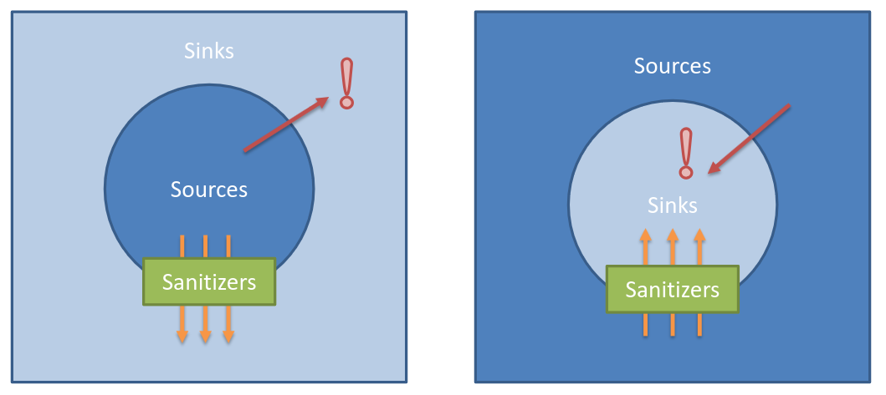
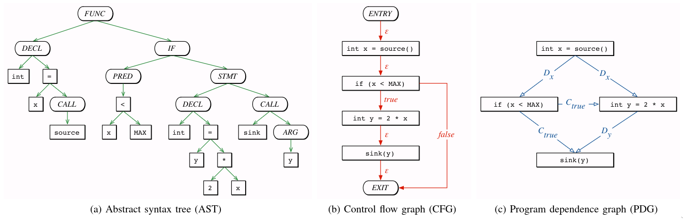

## 概述

静态漏洞挖掘，又称SAST，目标是在不实际执行程序的情况下，通过分析源代码来发现潜在安全漏洞。

SAST的工作原理借鉴并建立在编译原理和程序分析理论之上，其核心分析逻辑遵循以下步骤：
1. 代码抽象化，基于编译原理，将源代码转换成保留足够信息的抽象层表示。
2. 漏洞匹配
  - 模式匹配：直接在抽象层表示上匹配已知的不安全代码模式。
  - 静态污点分析：用于发现复杂的漏洞模式。

## 抽象层

### 一、编译原理

首先清楚源代码到汇编代码的编译流程：

- 前端：对源码进行词法分析(Lexical analysis)，生成令牌流(Token stream)，对令牌流进行语法上的分析，生成抽象语法树AST，最后对AST进行语义分析(Semantic analysis)，检查AST的语义是否正确。
- 中间层：根据语义分析后的AST，生成中间层表示(Intermediate representations)，对IR进行优化。
- 后端：选择指令，进行抽象汇编化处理(Abstract assembly)，分配寄存器，生成汇编代码。后续工作由汇编器和链接器承担。

抽象层有3种常用的中间表示，用来存储代码的各种逻辑：

1. 抽象语法树（AST），完整解析语法和语义，是生成其他中间表示的基础，但是这种原始结构不适合高级的代码分析。
2. 控制流程图（CFG），描述了基本块之间的执行路径，缺点是无法提供数据流信息。
3. 程序依赖图（PDG），表示数据依赖和控制依赖两种依赖关系，缺点是基本块无法进行区分。

### 二、CPG

2014年，代码属性图（CPG）首次作为建模和发现漏洞的概念被提出。将上述三种中间表示组合成一个联合结构体，实现能够表征漏洞类型的CPG,CPG有以下3个组成部分：
1. 节点。以AST生成的节点作为CPG的节点，类型包括函数、变量、控制结构，也包括高级结构，比如HTTP端点。每个节点都有一个类型。类型表示由节点表示的程序构造的类型，例如，具有`METHOD`类型的节点表示方法，而具有`LOCAL`类型的节点表示局部变量的声明。
2. 边。CPG的边是有标签的有向边，由CFG、PDG生成的边构成，表示节点之间的多种关系。例如，为了表示一个函数包含一个局部变量，我们可以创建一条从函数节点到局部变量节点的带有`contains`标签的边。
3. 键值对。节点携带键值对（属性），其中有效的键依赖于节点类型。例如，函数至少有一个名称和一个签名，而局部声明至少有声明变量的名称和类型。

CPG是有向的、有边标记的、有属性的多图，并且我们每个节点至少携带一个表示其类型的属性。

## 查询层

### 一、模式匹配

### 二、静态污点分析

